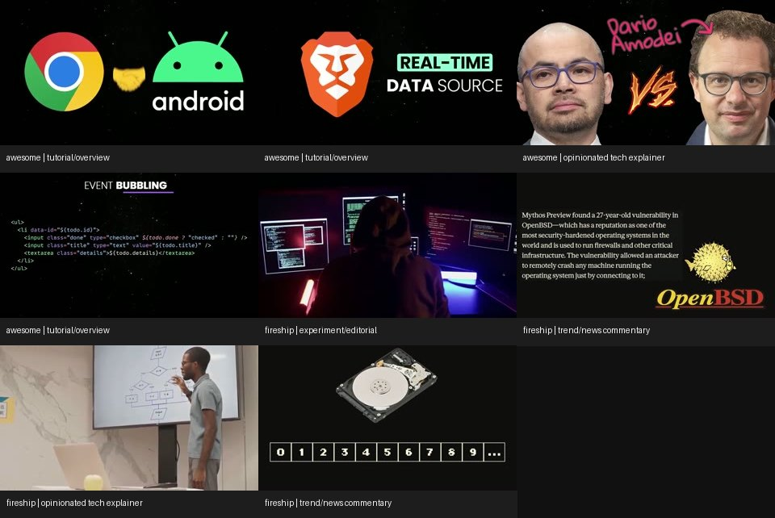

# Awesome/Fireship Video Pattern Reference

Distills public Awesome (`@awesome-coding`) and Fireship videos from 2025-07-06 through 2026-07-06: 181 public videos, 105 Awesome and 76 Fireship. Members-only excluded.

Use for Awesome/Fireship-inspired briefs, scripts, storyboards, animation/audio plans, transition critique, or validation.

Set `$env:AWSOME_VIDEOS_SKILL` before running commands.

## Corpus Evidence

Processing used low-res MP4s, thumbnails, English VTT, sampled frames, and silence detection. The machine-readable corpus summary, `assets/reference/corpus-summary.json`, contains `audioProfile`, `patternTaxonomy`, and the passed 2026-07-07 `artifactAudit`; `assets/reference/corpus-sources.json` is the source manifest for 181 IDs, dates, durations, URLs, and availability.

| Channel | Videos | Total minutes | Median duration | Median cut proxy | Median script density |
| --- | ---: | ---: | ---: | ---: | ---: |
| Awesome | 105 | 818.3 | 482s | 6.68 cuts/min | 222 WPM |
| Fireship | 76 | 388.8 | 299s | 8.76 cuts/min | 200 WPM |

Full-corpus distribution:

- Video types: opinionated tech explainer 55, trend/news commentary 54, tutorial/overview 46, compressed explainer 22, experiment/editorial 4.
- Transitions: steady jump cuts with visual punctuations 96, rapid hard cuts and inserts 74, longer screen-recording or talking-head beats 11.
- Visual style: dark UI/code/editorial palette 176, neutral UI/code montage 5.
- Script style: very dense voiceover, joke/claim every beat 176, fast explanatory narration 5.
- Representative audio silence ratio was very low, median 0.0035 across examples, which supports a continuous voiceover/music-bed production style.

## Example Frames

This contact sheet shows dark UI/code, logos, editorial inserts, code/schema screenshots, proof people, and sparse high-contrast type.



## Core Video Archetypes

### Compressed Explainer

Use for one technology, concept, or term. Target 60-160 seconds: 60-90 for demos, 90-160 for fuller explainers. Start with payoff, define it, show why it matters, give one example, and end with a limitation or next step.

Common shape:

1. 0:00-0:05: Cold claim or absurd compression of the concept.
2. 0:05-0:20: One-sentence definition plus logo/UI anchor.
3. 0:20-0:55: Mechanism, usually code, diagram, or terminal flow.
4. 0:55-1:25: Practical example with one visible state change.
5. 1:25-end: Tradeoff, warning, or final callback.

### Trend/News Commentary

Use for new releases, incidents, funding, lawsuits, security events, or tech drama. Target 3-6 minutes. The hook should name the weirdness or consequence first, then backfill the facts.

Common shape:

1. Incident or claim.
2. Why it matters.
3. Timeline of what changed.
4. Technical mechanism behind the story.
5. Winner/loser analysis.
6. Final implication or ironic callback.

### Tutorial/Overview

Use for teaching a stack, API, language, framework, or workflow. Target 5-12 minutes, unless it is a deep walkthrough. Awesome leans more toward longer teaching segments than Fireship.

Common shape:

1. Promise the useful outcome.
2. Name prerequisites.
3. Show the smallest working object.
4. Layer concepts in visible steps.
5. Insert a warning or common failure.
6. End with when to use it and when not to.

### Deep Walkthrough

Use only when screen/code time is the point. Keep periodic montage resets every 2-4 minutes: logo/title sting, zoomed code highlight, diagram recap, or before/after UI state.

## Script Patterns

Write the script as dense spoken beats. Each beat should do at least one job: define, surprise, contrast, joke, prove, warn, or transition.

Preferred script moves:

- Open with a claim, not throat-clearing.
- Compress context into one sentence before showing evidence.
- Use contrast pairs: "it looks simple, but..." or "the old way did X, the new way does Y."
- Add a joke or absurd analogy only when it makes a technical point easier to remember.
- Place a reset line after dense sections: "That sounds bad, but the real issue is..."
- End with a callback to the opening claim.
- Replace template voiceover placeholders with concrete lines; repeated filler is not a script.

Avoid:

- Long on-camera introductions.
- Multi-paragraph background before the first visual proof.
- Generic "in this video we will..." phrasing.
- Repeating the same explanatory voiceover line across beats.
- Explaining every UI field if only one field matters to the claim.

## Visual Pattern Library

Use a dark editorial base by default. Most corpus frames are dark UI/code/editorial palettes, often with high-contrast logos, screenshots, code, terminal panes, article snippets, or diagrams.

Visual atoms:

- Logo/title anchor: brand or technology logo large enough to read in the first 3-5 seconds.
- UI proof: screenshot, docs page, GitHub issue, terminal, dashboard, editor, or browser.
- Code proof: short snippet with one highlighted line, not a full unscannable wall.
- Diagram proof: box/arrow, timeline, dependency map, state machine, or comparison grid.
- Human/context insert: founder, speaker, lawsuit figure, conference clip, or article author when the story needs credibility.
- Meme/editorial insert: use as punctuation after a claim, never as the only explanation.

Animation atoms:

- Punch-in zoom to the meaningful UI/code region.
- Fast pan across a screenshot or timeline.
- Highlight sweep over one line or metric.
- Stack build: logo -> docs -> code -> output.
- Split-screen contrast: old/new, hype/reality, problem/fix.
- Counter/ticker animation for numbers, costs, time, or version changes.
- Diagram trace for network, dependency, event, or lifecycle flow.

## Transition Timing

Treat transitions as information punctuation. The corpus cut proxy implies a new visual punctuation roughly every 7-9 seconds for normal videos, with Fireship often closer to every 6-7 seconds.

Recommended transition map:

- 0:00: cold hard cut or smash intro into logo/UI proof.
- Every 6-10 seconds in compressed/news formats: hard cut, punch-in, overlay, insert, or diagram state change.
- Every new section: title card, zoom reset, match cut between similar UI shapes, or short glitch/wipe.
- Every joke or reversal: meme/image insert, quick freeze, or snap zoom.
- Every proof point: cut from voiceover claim to source screenshot, then punch into the exact evidence.
- Every code step: scroll or highlight instead of a decorative transition.

Use fewer transitions in long walkthroughs, but add a recap or visual reset every 2-4 minutes.

## Music And Sound

The style is voiceover-led with near-continuous sound.

Audio roles:

- Background bed: starts at 0:00 or immediately after the hook; duck under narration.
- Hit/stinger: use on title reveal, punchline, claim reversal, or section break.
- Whoosh/tick: use for quick zooms, pop-in labels, fast UI pans, and code highlights.
- Low impact: use for security incidents, outages, lawsuit turns, or "this is bad" beats.
- Riser: use before revealing a surprising number, product, or consequence.
- Dropout: use rare near-silence for a joke pause or serious warning, usually under 1 second.

Do not specify copyrighted songs. Specify production intent: tempo, mood, ducking, and cue timing.

## Brief Template

Use this structure for generated plans:

```markdown
# Title

Promise:
Audience:
Format:
Runtime:

## Hook

Cold-open line:
First visual:
Audio cue:

## Timed Beat Table

| Time | Script purpose | Visual | Animation | Transition | Audio |
| --- | --- | --- | --- | --- | --- |
| 0:00-0:05 | Claim or contradiction | Logo + source screenshot | Smash scale-in | Hard cut | Hit + bed starts |
| 0:05-0:15 | Define the thing | Diagram or docs page | Highlight sweep | Punch-in | Bed ducked |

## Assets

- Screenshots:
- Code/UI captures:
- Diagrams/generated visuals:
- Source links: concrete URLs or domains for docs, code, articles, dashboards, or issue pages.

## Evaluation

- Hook is visible in the first 5 seconds.
- A new visual idea appears every 6-10 seconds for short videos.
- Every transition marks a new idea, proof point, or joke.
- Audio has bed, hits, and ducking notes.
```

## End-To-End Evaluation Commands

`command-contracts.md`.

Select a style blueprint with `uv run --script $env:AWSOME_VIDEOS_SKILL/scripts/select_video_patterns.py --title "What Is X?" --runtime 1:10 --json`; expect `"ok": true`, `selectedFormat`, 8 `beatGuidance` rows, `PASS awsome-videos pattern blueprint`.

Validate a generated brief with machine-readable output:

```powershell
uv run --script $env:AWSOME_VIDEOS_SKILL/scripts/check_video_brief.py path/to/brief.md --require-voiceover --json
```

A passing brief has 8+ specific timed beats. Text starts with `PASS awsome-videos brief`; for source-backed JSON add `--require-source-links` and require positive `source_link_count` with empty `source_link_failures`.

For finished-video validation, scaffold once, replace its wireframe with source-bound assets and scene-specific compositions, complete the rendered review, then run the full gate chain:

```powershell
$p="projects/my-video"; $s="$p/source"; $r="$p/artifacts/reviews"; $x="$p/src/index.html"; $v="$p/artifacts/videos/final.mp4"
uv run --script $env:AWSOME_VIDEOS_SKILL/scripts/check_runtime_tools.py --require-render-tools --json
uv run --script $env:AWSOME_VIDEOS_SKILL/scripts/scaffold_production_package.py $p --title "What Is X?" --json
# Replace the scaffold assets and renderer, render once, and author visual-review.json before the final gates.
uv run --script $env:AWSOME_VIDEOS_SKILL/scripts/extract_voiceover_cues.py $s/brief.md --format json --min-cues 8 --expect-duration 70 --duration-tolerance 1 --require-beat-match --output $p/artifacts/audio/voiceover-cues.json
uv run --script $env:AWSOME_VIDEOS_SKILL/scripts/score_style_fidelity.py --brief $s/brief.md --pattern-blueprint $s/pattern-blueprint.json --require-voiceover --require-pattern-blueprint --require-source-links --output $r/style-fidelity.json --json
uv run --script $env:AWSOME_VIDEOS_SKILL/scripts/check_renderer_contract.py $x --brief $s/brief.md --duration 70 --require-all-brief-beats --asset-manifest $s/asset-manifest.json --composition-plan $s/composition-plan.json --require-visual-ids --screenshot-dir $r/renderer-frames --output $r/renderer-contract.json --json
uv run --script $env:AWSOME_VIDEOS_SKILL/scripts/render_concept_video.py $x $v --brief $s/brief.md --require-all-brief-beats --duration 70 --fps 30 --capture-fps 12 --force --contact-sheet $r/contact-sheet.jpg --quality-report $r/quality-report.json --motion-report $r/motion-report.json --capture-manifest $r/capture-manifest.json --render-state-report $r/render-state.json --audio-report $r/audio-report.json --json
uv run --script $env:AWSOME_VIDEOS_SKILL/scripts/check_visual_contract.py --asset-manifest $s/asset-manifest.json --composition-plan $s/composition-plan.json --visual-review $r/visual-review.json --video $v --brief $s/brief.md --project-root $p --min-assets 8 --min-scenes 8 --require-ready-assets --require-specialist-routing --require-source-routing --require-reviewed-scenes --output $r/asset-composition-validation.json --json
uv run --script $env:AWSOME_VIDEOS_SKILL/scripts/score_video_readiness.py --require-source-links --brief $s/brief.md --video $v --renderer $x --renderer-report $r/renderer-contract.json --asset-manifest $s/asset-manifest.json --composition-plan $s/composition-plan.json --visual-review $r/visual-review.json --visual-contract-report $r/asset-composition-validation.json --require-visual-contract-report --quality-report $r/quality-report.json --motion-report $r/motion-report.json --capture-manifest $r/capture-manifest.json --audio-report $r/audio-report.json --contact-sheet $r/contact-sheet.jpg --require-voiceover --output $r/readiness-score.json --json
uv run --script $env:AWSOME_VIDEOS_SKILL/scripts/check_production_package.py --require-source-links --brief $s/brief.md --video $v --design-note $s/design-note.md --production-notes $s/production-notes.md --package-manifest $s/package-manifest.json --pattern-blueprint $s/pattern-blueprint.json --asset-manifest $s/asset-manifest.json --composition-plan $s/composition-plan.json --visual-review $r/visual-review.json --visual-contract-report $r/asset-composition-validation.json --renderer $x --renderer-report $r/renderer-contract.json --readiness-report $r/readiness-score.json --style-fidelity-report $r/style-fidelity.json --contact-sheet $r/contact-sheet.jpg --quality-report $r/quality-report.json --motion-report $r/motion-report.json --capture-manifest $r/capture-manifest.json --audio-report $r/audio-report.json --expect-width 1280 --expect-height 720 --expect-fps 30 --expect-duration 70 --duration-tolerance 1 --min-readiness-score 18 --min-style-fidelity-score 12 --require-audio --require-audio-report --require-voiceover --require-design-note --require-production-notes --require-package-manifest --require-pattern-blueprint --require-visual-contract --require-ready-assets --require-specialist-routing --require-source-routing --require-reviewed-scenes --require-renderer --forbid-scaffold-renderer --require-renderer-report --require-renderer-beat-coverage --require-renderer-visual-coverage --require-readiness-report --require-style-fidelity-report --require-final-review-notes --require-contact-sheet --require-motion-report --json
```

Expected: preflight starts `PASS awsome-videos runtime preflight`; cue JSON has `cueCount` and empty `beatCueMismatches`. Use `create_concept_renderer.py` only as a starter. Renderer JSON needs nonblank screenshot samples, `briefBeatCoverageOk`, current hashes, and full visible-ID coverage; visual review needs approved scene/seam evidence and zero blockers. Render output includes a nonblank contact sheet and reports. Style starts `PASS awsome-videos style fidelity`, score at least 12/16, and no `penalties`; readiness must score at least 18/24 with no `weakCategories`; package starts `PASS awsome-videos package` or returns `"ok": true`.

Final notes replace pending lines with non-thin `Legibility check`, `Beat coverage check`, `Visual mechanism check`, `Pacing/transition check`, `Source-binding check`, `Audio sync check`, and `Known caveats` before `--require-final-review-notes`. For publishable audio add `--require-final-audio`; require `finalAudioDurationOk: true`, runtime-covered `sourceDurationSeconds`, `paths.finalAudio`, empty `missingFinalAudioCommandTerms`, and use `--final-audio-duration-tolerance` only for short tails.

Validate corpus provenance, summary, source manifest, image, pattern categories, commands, and expected outputs with:

```powershell
uv run --script $env:AWSOME_VIDEOS_SKILL/scripts/check_reference_completeness.py --json
```

Expected successful reference output has `"ok": true` or starts with `PASS awsome-videos reference`.
