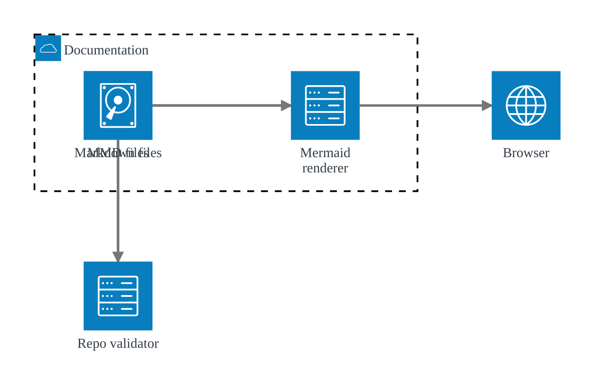

# Architecture

```mermaid
---
config:
  theme: base
  architecture:
    nodeSeparation: 95
    idealEdgeLengthMultiplier: 2
    seed: 7
  themeVariables:
    fontFamily: "'Open Sans', arial, sans-serif"
    primaryColor: '#cdf3ff'
    primaryTextColor: '#333E48'
    primaryBorderColor: '#007298'
    lineColor: '#45842a'
    secondaryColor: '#fff4cc'
    tertiaryColor: '#ffccd5'
---
architecture-beta
  group docs(cloud)[Documentation]
  service source(disk)[MMD files] in docs
  service markdown(disk)[Markdown files] in docs
  service renderer(server)[Mermaid renderer] in docs
  service browser(internet)[Browser]
  service validator(server)[Repo validator]

  source:R --> L:renderer
  markdown:R --> L:renderer
  renderer:R --> L:browser
  source:B --> T:validator
  markdown:B --> T:validator
```
