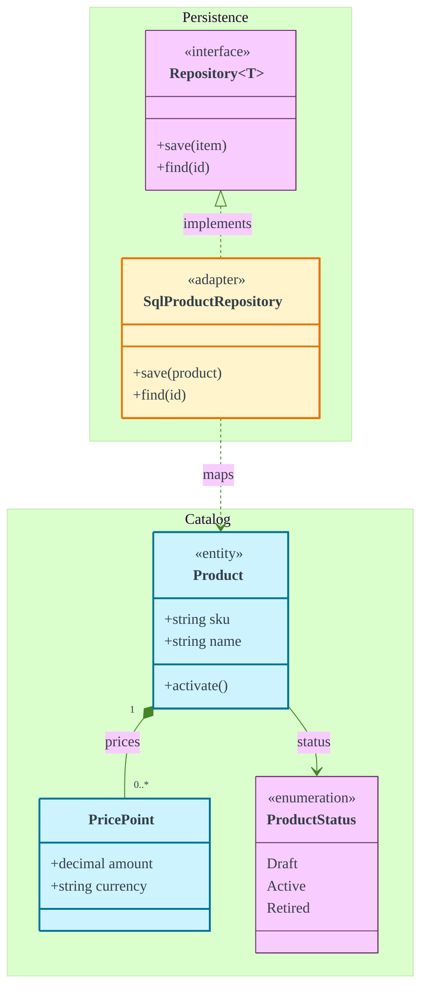

# Class Namespace Generics

```mermaid
---
config:
  theme: base
  themeVariables:
    fontFamily: "'Open Sans', arial, sans-serif"
    primaryColor: '#f9ccff'
    primaryTextColor: '#333E48'
    primaryBorderColor: '#652f6c'
    lineColor: '#45842a'
    secondaryColor: '#ffe5cc'
    tertiaryColor: '#dbffcc'
---
classDiagram
  direction TB
  namespace Catalog {
    class Product {
      <<entity>>
      +string sku
      +string name
      +activate()
    }
    class PricePoint {
      +decimal amount
      +string currency
    }
    class ProductStatus {
      <<enumeration>>
      Draft
      Active
      Retired
    }
  }

  namespace Persistence {
    class Repository~T~ {
      <<interface>>
      +save(item)
      +find(id)
    }
    class SqlProductRepository {
      <<adapter>>
      +save(product)
      +find(id)
    }
  }

  Product "1" *-- "0..*" PricePoint : prices
  Product --> ProductStatus : status
  Repository~T~ <|.. SqlProductRepository : implements
  SqlProductRepository ..> Product : maps

  style Product fill:#cdf3ff,stroke:#007298,color:#333E48,stroke-width:2px
  style PricePoint fill:#cdf3ff,stroke:#007298,color:#333E48,stroke-width:2px
  style SqlProductRepository fill:#fff4cc,stroke:#e77204,color:#333E48,stroke-width:2px

```
