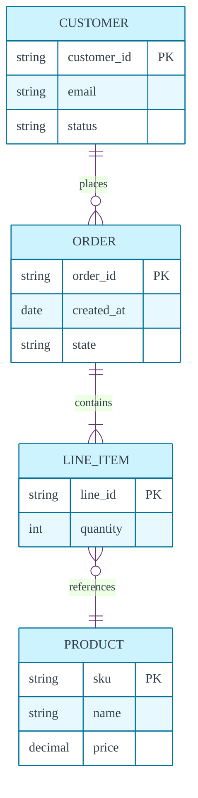

# Entity Relationship Diagram

```mermaid
---
config:
  theme: base
  themeVariables:
    fontFamily: "'Open Sans', arial, sans-serif"
    primaryColor: '#cdf3ff'
    primaryTextColor: '#333E48'
    primaryBorderColor: '#007298'
    lineColor: '#652f6c'
    secondaryColor: '#fff4cc'
    tertiaryColor: '#dbffcc'
---
erDiagram
  CUSTOMER ||--o{ ORDER : places
  CUSTOMER {
    string customer_id PK
    string email
    string status
  }
  ORDER ||--|{ LINE_ITEM : contains
  ORDER {
    string order_id PK
    date created_at
    string state
  }
  LINE_ITEM }o--|| PRODUCT : references
  LINE_ITEM {
    string line_id PK
    int quantity
  }
  PRODUCT {
    string sku PK
    string name
    decimal price
  }
```
