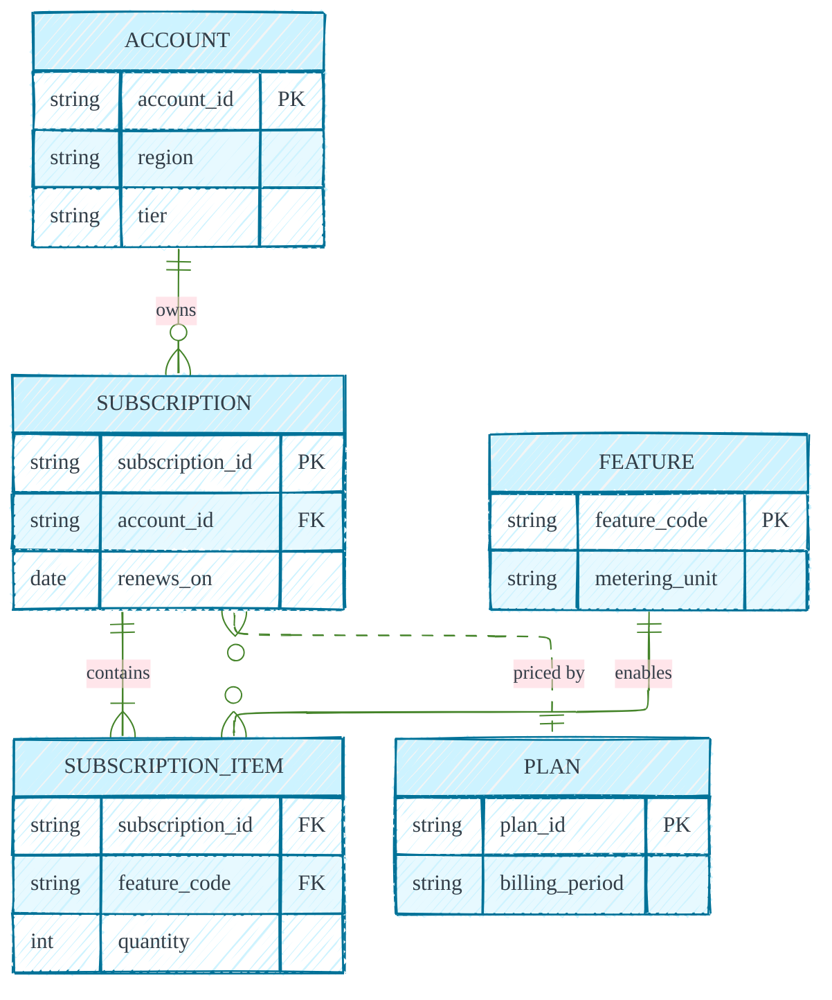

# ER Identifying Relationships

```mermaid
---
config:
  theme: base
  layout: elk
  look: handDrawn
  themeVariables:
    fontFamily: "'Open Sans', arial, sans-serif"
    primaryColor: '#cdf3ff'
    primaryTextColor: '#333E48'
    primaryBorderColor: '#007298'
    lineColor: '#45842a'
    secondaryColor: '#fff4cc'
    tertiaryColor: '#ffccd5'
---
erDiagram
  ACCOUNT ||--o{ SUBSCRIPTION : owns
  SUBSCRIPTION ||--|{ SUBSCRIPTION_ITEM : contains
  FEATURE ||--o{ SUBSCRIPTION_ITEM : enables
  SUBSCRIPTION }o..|| PLAN : "priced by"

  ACCOUNT {
    string account_id PK
    string region
    string tier
  }
  SUBSCRIPTION {
    string subscription_id PK
    string account_id FK
    date renews_on
  }
  SUBSCRIPTION_ITEM {
    string subscription_id FK
    string feature_code FK
    int quantity
  }
  FEATURE {
    string feature_code PK
    string metering_unit
  }
  PLAN {
    string plan_id PK
    string billing_period
  }
```
