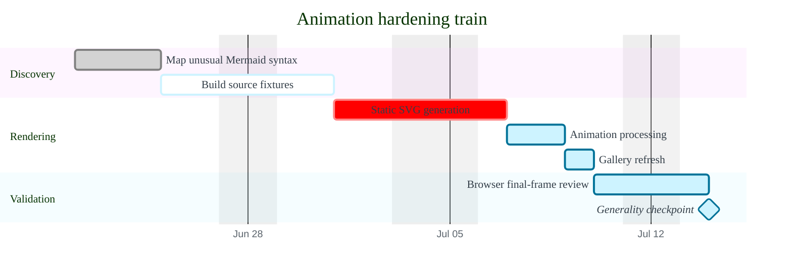

# Gantt Calendar Exclusions

```mermaid
---
config:
  theme: base
  gantt:
    barHeight: 20
    barGap: 5
    topPadding: 50
  themeVariables:
    fontFamily: "'Open Sans', arial, sans-serif"
    primaryColor: '#cdf3ff'
    primaryTextColor: '#333E48'
    primaryBorderColor: '#007298'
    lineColor: '#45842a'
    secondaryColor: '#fff4cc'
    tertiaryColor: '#f9ccff'
---
gantt
  title Animation hardening train
  dateFormat YYYY-MM-DD
  axisFormat %b %d
  tickInterval 1week
  excludes weekends, 2026-07-03
  todayMarker stroke-width:3px,stroke:#652f6c,opacity:0.75

  section Discovery
  Map unusual Mermaid syntax       :done, discover, 2026-06-22, 3d
  Build source fixtures            :active, fixtures, after discover, 4d

  section Rendering
  Static SVG generation            :crit, render, after fixtures, 3d
  Animation processing             :animate, after render, 2d
  Gallery refresh                  :gallery, after animate, 1d

  section Validation
  Browser final-frame review       :review, after gallery, 2d
  Generality checkpoint            :milestone, checkpoint, after review, 0d
```
