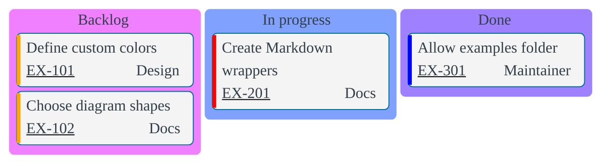

# Kanban

```mermaid
---
config:
  theme: base
  kanban:
    ticketBaseUrl: 'https://example.invalid/browse/#TICKET#'
  themeVariables:
    fontFamily: "'Open Sans', arial, sans-serif"
    primaryColor: '#cdf3ff'
    primaryTextColor: '#333E48'
    primaryBorderColor: '#007298'
    lineColor: '#45842a'
    secondaryColor: '#fff4cc'
    tertiaryColor: '#f9ccff'
---
kanban
  backlog[Backlog]
    colors[Define custom colors]@{ ticket: EX-101, assigned: 'Design', priority: 'High' }
    shapes[Choose diagram shapes]@{ ticket: EX-102, assigned: 'Docs', priority: 'High' }
  progress[In progress]
    wrappers[Create Markdown wrappers]@{ ticket: EX-201, assigned: 'Docs', priority: 'Very High' }
  done[Done]
    validator[Allow examples folder]@{ ticket: EX-301, assigned: 'Maintainer', priority: 'Low' }
```
