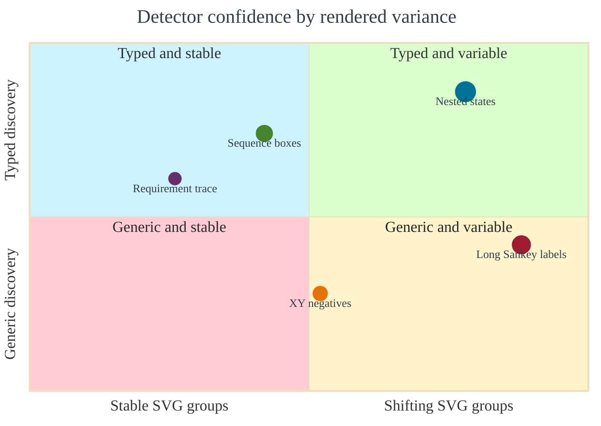

# Quadrant Boundary Cases

```mermaid
---
config:
  theme: base
  quadrantChart:
    chartWidth: 620
    chartHeight: 440
    pointRadius: 7
  themeVariables:
    fontFamily: "'Open Sans', arial, sans-serif"
    quadrant1Fill: '#dbffcc'
    quadrant2Fill: '#cdf3ff'
    quadrant3Fill: '#ffccd5'
    quadrant4Fill: '#fff4cc'
    quadrantPointFill: '#652f6c'
    quadrantPointTextFill: '#333E48'
    quadrantTitleFill: '#333E48'
---
quadrantChart
  title Detector confidence by rendered variance
  x-axis Stable SVG groups --> Shifting SVG groups
  y-axis Generic discovery --> Typed discovery
  quadrant-1 Typed and variable
  quadrant-2 Typed and stable
  quadrant-3 Generic and stable
  quadrant-4 Generic and variable
  Nested states: [0.78, 0.86] radius: 11, color: #007298
  Sequence boxes: [0.42, 0.74] radius: 9, color: #45842a
  XY negatives: [0.52, 0.28] radius: 8, color: #e77204
  Long Sankey labels: [0.88, 0.42] radius: 10, color: #9e1b32
  Requirement trace: [0.26, 0.61] radius: 7, color: #652f6c
```
