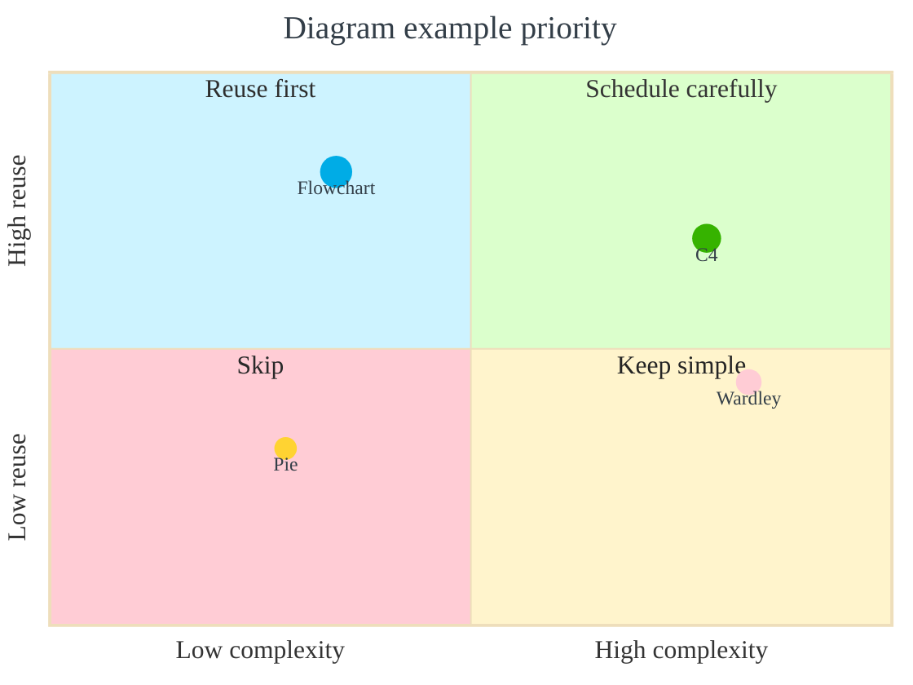

# Quadrant Chart

```mermaid
---
config:
  theme: base
  quadrantChart:
    chartWidth: 560
    chartHeight: 420
    pointRadius: 8
  themeVariables:
    fontFamily: "'Open Sans', arial, sans-serif"
    quadrant1Fill: '#dbffcc'
    quadrant2Fill: '#cdf3ff'
    quadrant3Fill: '#ffccd5'
    quadrant4Fill: '#fff4cc'
    quadrantPointFill: '#652f6c'
    quadrantPointTextFill: '#333E48'
    quadrantTitleFill: '#333E48'
---
quadrantChart
  title Diagram example priority
  x-axis Low complexity --> High complexity
  y-axis Low reuse --> High reuse
  quadrant-1 Schedule carefully
  quadrant-2 Reuse first
  quadrant-3 Skip
  quadrant-4 Keep simple
  Flowchart: [0.34, 0.82] radius: 10, color: #00ace6
  C4: [0.78, 0.70] radius: 9, color: #36b300
  Pie: [0.28, 0.32] radius: 7, color: #ffd332
  Wardley: [0.83, 0.44] radius: 8, color: #ffccd5
```
