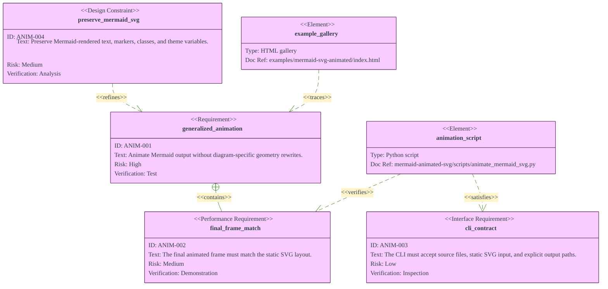

# Requirement Traceability Matrix

```mermaid
---
config:
  theme: base
  themeVariables:
    fontFamily: "'Open Sans', arial, sans-serif"
    primaryColor: '#f9ccff'
    primaryTextColor: '#333E48'
    primaryBorderColor: '#652f6c'
    lineColor: '#45842a'
    secondaryColor: '#fff4cc'
    tertiaryColor: '#cdf3ff'
---
requirementDiagram
  direction TB
  requirement generalized_animation {
    id: "ANIM-001"
    text: "Animate Mermaid output without diagram-specific geometry rewrites."
    risk: high
    verifymethod: test
  }
  performanceRequirement final_frame_match {
    id: "ANIM-002"
    text: "The final animated frame must match the static SVG layout."
    risk: medium
    verifymethod: demonstration
  }
  interfaceRequirement cli_contract {
    id: "ANIM-003"
    text: "The CLI must accept source files, static SVG input, and explicit output paths."
    risk: low
    verifymethod: inspection
  }
  designConstraint preserve_mermaid_svg {
    id: "ANIM-004"
    text: "Preserve Mermaid-rendered text, markers, classes, and theme variables."
    risk: medium
    verifymethod: analysis
  }

  element animation_script {
    type: "Python script"
    docref: "mermaid-animated-svg/scripts/animate_mermaid_svg.py"
  }
  element example_gallery {
    type: "HTML gallery"
    docref: "examples/mermaid-svg-animated/index.html"
  }

  generalized_animation - contains -> final_frame_match
  preserve_mermaid_svg - refines -> generalized_animation
  animation_script - satisfies -> cli_contract
  animation_script - verifies -> final_frame_match
  example_gallery - traces -> generalized_animation
```
