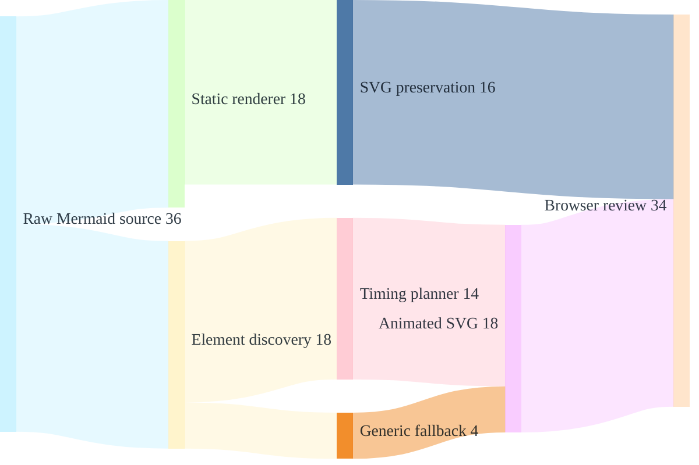

# Sankey Wide Labels

```mermaid
---
config:
  theme: base
  sankey:
    showValues: true
    linkColor: source
    nodeAlignment: left
    nodeWidth: 14
    nodePadding: 14
    labelStyle: plain
    nodeColors:
      "Raw Mermaid source": '#cdf3ff'
      "Static renderer": '#dbffcc'
      "Element discovery": '#fff4cc'
      "Timing planner": '#ffccd5'
      "Animated SVG": '#f9ccff'
      "Browser review": '#ffe5cc'
  themeVariables:
    fontFamily: "'Open Sans', arial, sans-serif"
    primaryTextColor: '#333E48'
---
sankey
  Raw Mermaid source,Static renderer,18
  Raw Mermaid source,Element discovery,18
  Static renderer,SVG preservation,16
  Element discovery,Timing planner,14
  Element discovery,Generic fallback,4
  Timing planner,Animated SVG,14
  Generic fallback,Animated SVG,4
  Animated SVG,Browser review,18
  SVG preservation,Browser review,16
```
