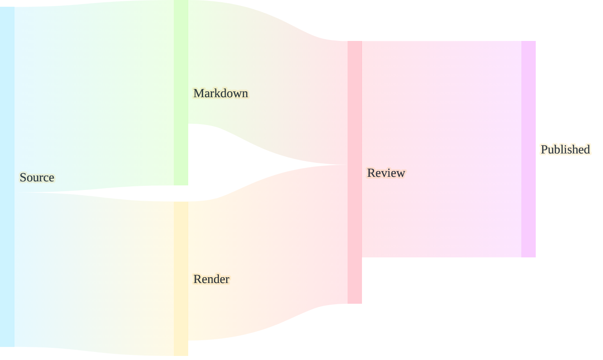

# Sankey

```mermaid
---
config:
  theme: base
  sankey:
    showValues: false
    linkColor: gradient
    nodeAlignment: justify
    nodeWidth: 16
    nodePadding: 18
    labelStyle: outlined
    nodeColors:
      Source: '#cdf3ff'
      Markdown: '#dbffcc'
      Render: '#fff4cc'
      Review: '#ffccd5'
      Published: '#f9ccff'
  themeVariables:
    fontFamily: "'Open Sans', arial, sans-serif"
    primaryTextColor: '#333E48'
---
sankey
  Source,Markdown,12
  Source,Render,10
  Markdown,Review,8
  Render,Review,9
  Review,Published,14
```
