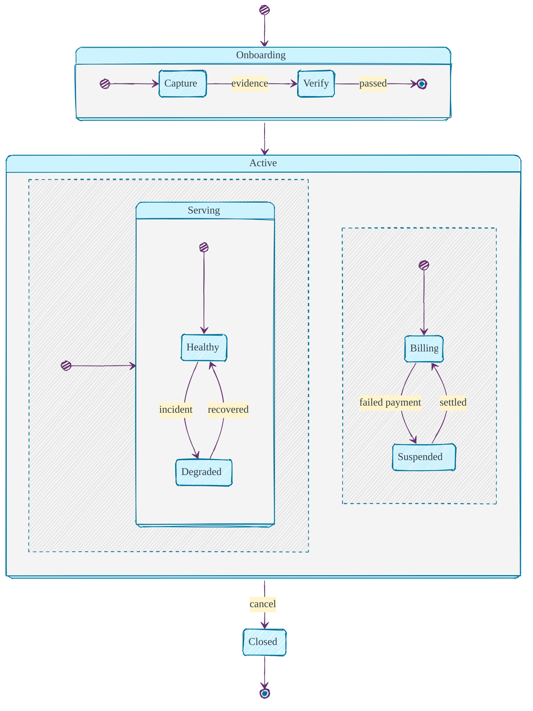

# State Composite Regions

```mermaid
---
config:
  theme: base
  layout: dagre
  look: handDrawn
  themeVariables:
    fontFamily: "'Open Sans', arial, sans-serif"
    primaryColor: '#cdf3ff'
    primaryTextColor: '#333E48'
    primaryBorderColor: '#007298'
    lineColor: '#652f6c'
    secondaryColor: '#fff4cc'
    tertiaryColor: '#ffccd5'
---
stateDiagram-v2
  direction TB
  [*] --> Onboarding

  state Onboarding {
    direction LR
    [*] --> Capture
    Capture --> Verify: evidence
    Verify --> [*]: passed
  }

  Onboarding --> Active

  state Active {
    direction LR
    [*] --> Serving
    state Serving {
      [*] --> Healthy
      Healthy --> Degraded: incident
      Degraded --> Healthy: recovered
    }
    --
    [*] --> Billing
    Billing --> Suspended: failed payment
    Suspended --> Billing: settled
  }

  Active --> Closed: cancel
  Closed --> [*]
```
