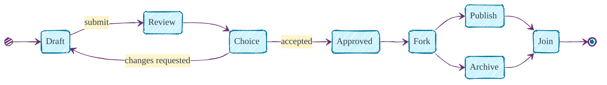

# State Diagram

```mermaid
---
config:
  theme: base
  layout: dagre
  look: handDrawn
  themeVariables:
    fontFamily: "'Open Sans', arial, sans-serif"
    primaryColor: '#cdf3ff'
    primaryTextColor: '#333E48'
    primaryBorderColor: '#007298'
    lineColor: '#652f6c'
    secondaryColor: '#fff4cc'
    tertiaryColor: '#ffccd5'
---
stateDiagram-v2
  direction LR
  [*] --> Draft
  Draft --> Review: submit
  Review --> Choice
  Choice --> Approved: accepted
  Choice --> Draft: changes requested
  Approved --> Fork
  Fork --> Publish
  Fork --> Archive
  Publish --> Join
  Archive --> Join
  Join --> [*]

  state Choice <<choice>>
  state Fork <<fork>>
  state Join <<join>>
```
