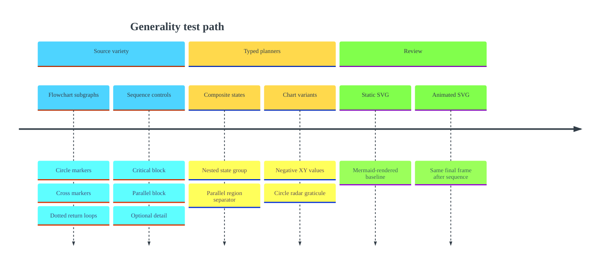

# Timeline Dense Groups

```mermaid
---
config:
  theme: base
  themeVariables:
    fontFamily: "'Open Sans', arial, sans-serif"
    primaryColor: '#cdf3ff'
    primaryTextColor: '#333E48'
    primaryBorderColor: '#007298'
    lineColor: '#652f6c'
    secondaryColor: '#fff4cc'
    tertiaryColor: '#dbffcc'
---
timeline
  title Generality test path
  section Source variety
    Flowchart subgraphs : Circle markers
                    : Cross markers
                    : Dotted return loops
    Sequence controls : Critical block
                      : Parallel block
                      : Optional detail
  section Typed planners
    Composite states : Nested state group
                     : Parallel region separator
    Chart variants : Negative XY values
                   : Circle radar graticule
  section Review
    Static SVG : Mermaid-rendered baseline
    Animated SVG : Same final frame after sequence
```
