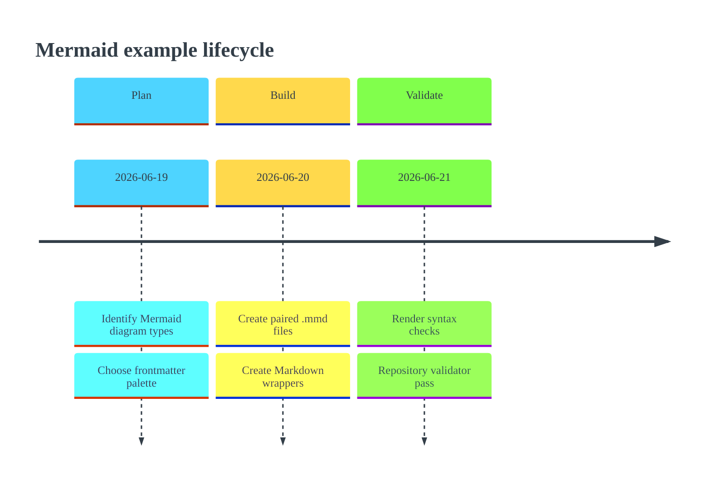

# Timeline

```mermaid
---
config:
  theme: base
  themeVariables:
    fontFamily: "'Open Sans', arial, sans-serif"
    primaryColor: '#cdf3ff'
    primaryTextColor: '#333E48'
    primaryBorderColor: '#007298'
    lineColor: '#652f6c'
    secondaryColor: '#fff4cc'
    tertiaryColor: '#dbffcc'
---
timeline
  title Mermaid example lifecycle
  section Plan
    2026-06-19 : Identify Mermaid diagram types
               : Choose frontmatter palette
  section Build
    2026-06-20 : Create paired .mmd files
               : Create Markdown wrappers
  section Validate
    2026-06-21 : Render syntax checks
               : Repository validator pass
```
