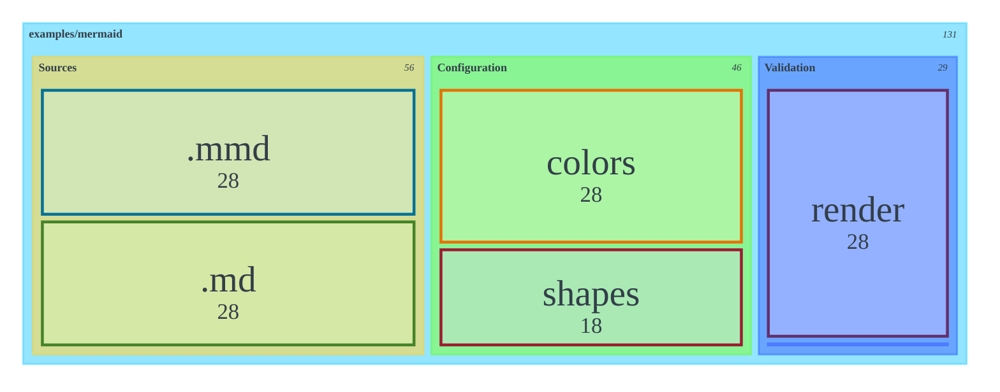

# Treemap

```mermaid
---
config:
  theme: base
  treemap:
    diagramPadding: 24
    padding: 8
    showValues: true
    valueFormat: ','
  themeVariables:
    fontFamily: "'Open Sans', arial, sans-serif"
    primaryColor: '#cdf3ff'
    primaryTextColor: '#333E48'
    primaryBorderColor: '#007298'
    secondaryColor: '#fff4cc'
    tertiaryColor: '#dbffcc'
---
treemap-beta
  "examples/mermaid"
    "Sources"
      ".mmd": 28:::source
      ".md": 28:::docs
    "Configuration"
      "colors": 28:::theme
      "shapes": 18:::shape
    "Validation"
      "repo": 1
      "render": 28:::check
  classDef source fill:#cdf3ff,color:#333E48,stroke:#007298;
  classDef docs fill:#dbffcc,color:#333E48,stroke:#45842a;
  classDef theme fill:#fff4cc,color:#333E48,stroke:#e77204;
  classDef shape fill:#f9ccff,color:#333E48,stroke:#9e1b32;
  classDef check fill:#f9ccff,color:#333E48,stroke:#652f6c;
```
