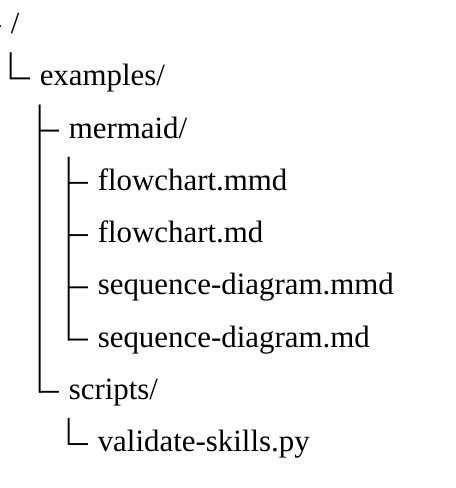

# TreeView

```mermaid
---
config:
  theme: base
  themeVariables:
    fontFamily: "'Open Sans', arial, sans-serif"
    primaryColor: '#cdf3ff'
    primaryTextColor: '#333E48'
    primaryBorderColor: '#007298'
    lineColor: '#45842a'
    secondaryColor: '#fff4cc'
    tertiaryColor: '#dbffcc'
---
treeView-beta
"examples/"
  "mermaid/"
    "flowchart.mmd"
    "flowchart.md"
    "sequence-diagram.mmd"
    "sequence-diagram.md"
  "scripts/"
    "validate-skills.py"
```
