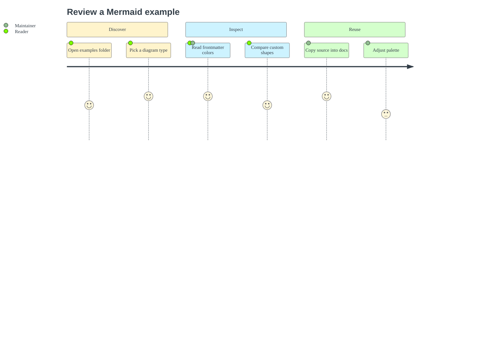

# User Journey

```mermaid
---
config:
  theme: base
  journey:
    diagramMarginX: 40
    diagramMarginY: 20
  themeVariables:
    fontFamily: "'Open Sans', arial, sans-serif"
    primaryColor: '#fff4cc'
    primaryTextColor: '#333E48'
    primaryBorderColor: '#994a00'
    lineColor: '#45842a'
    secondaryColor: '#cdf3ff'
    tertiaryColor: '#f9ccff'
---
journey
  title Review a Mermaid example
  section Discover
    Open examples folder: 4: Reader
    Pick a diagram type: 5: Reader
  section Inspect
    Read frontmatter colors: 5: Reader, Maintainer
    Compare custom shapes: 4: Reader
  section Reuse
    Copy source into docs: 5: Maintainer
    Adjust palette: 3: Maintainer
```
