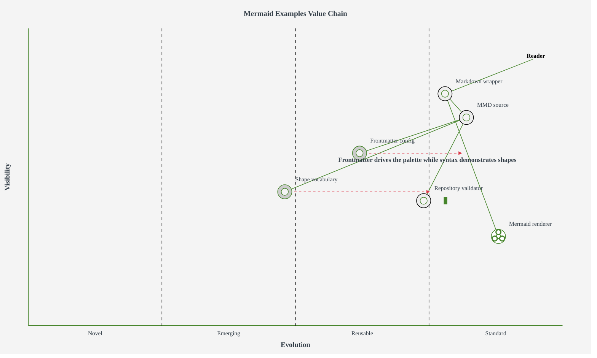

# Wardley

```mermaid
---
config:
  theme: base
  themeVariables:
    fontFamily: "'Open Sans', arial, sans-serif"
    primaryColor: '#cdf3ff'
    primaryTextColor: '#333E48'
    primaryBorderColor: '#007298'
    lineColor: '#45842a'
    secondaryColor: '#fff4cc'
    tertiaryColor: '#f9ccff'
---
wardley-beta
  title Mermaid Examples Value Chain
  size [1000, 600]
  evolution Novel -> Emerging -> Reusable -> Standard
  anchor Reader [0.90, 0.95]
  component Markdown wrapper [0.78, 0.78] (build)
  component MMD source [0.70, 0.82] (build)
  component Frontmatter config [0.58, 0.62] (buy)
  component Shape vocabulary [0.45, 0.48] (buy)
  component Mermaid renderer [0.30, 0.88] (market)
  component Repository validator [0.42, 0.74] (build) (inertia)

  Reader -> Markdown wrapper
  Markdown wrapper -> MMD source
  MMD source -> Frontmatter config
  MMD source -> Shape vocabulary
  Markdown wrapper -> Mermaid renderer
  Repository validator -> MMD source
  evolve Frontmatter config 0.82
  evolve Shape vocabulary 0.76
  note "Frontmatter drives the palette while syntax demonstrates shapes" [0.55, 0.58]
```
