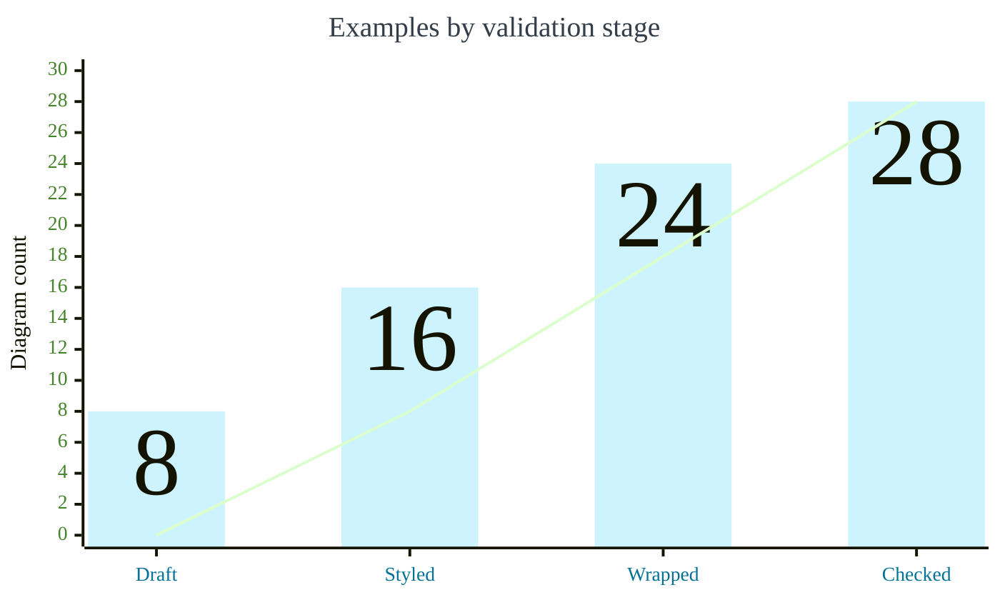

# XY Chart

```mermaid
---
config:
  theme: base
  xyChart:
    width: 700
    height: 420
    showDataLabel: true
  themeVariables:
    fontFamily: "'Open Sans', arial, sans-serif"
    xyChart:
      backgroundColor: '#ffffff'
      titleColor: '#333E48'
      xAxisLabelColor: '#007298'
      yAxisLabelColor: '#45842a'
      plotColorPalette: '#cdf3ff, #dbffcc, #ffe5cc'
---
xychart-beta
  title "Examples by validation stage"
  x-axis [Draft, Styled, Wrapped, Checked]
  y-axis "Diagram count" 0 --> 30
  bar "sources" [8, 16, 24, 28]
  line "validated" [0, 8, 18, 28]
```
