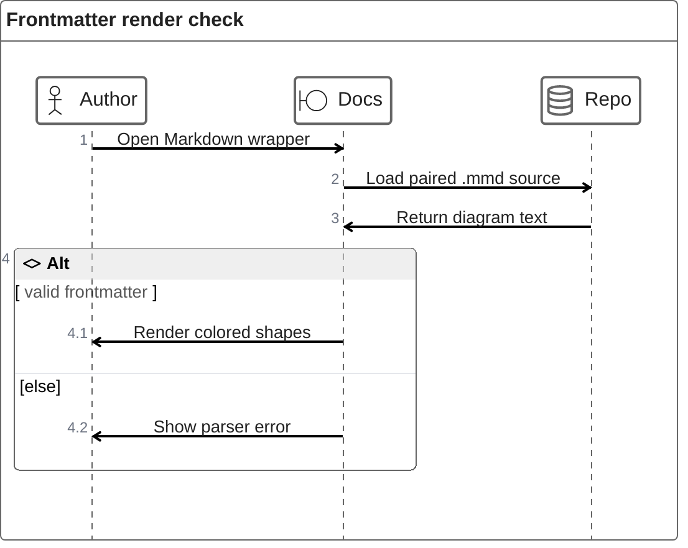

# ZenUML

```mermaid
---
config:
  theme: base
  themeVariables:
    fontFamily: "'Open Sans', arial, sans-serif"
    primaryColor: '#cdf3ff'
    primaryTextColor: '#333E48'
    primaryBorderColor: '#007298'
    lineColor: '#45842a'
    secondaryColor: '#fff4cc'
    tertiaryColor: '#f9ccff'
---
zenuml
  title Frontmatter render check
  @Actor Author
  @Boundary Docs
  @Database Repo

  Author->Docs: Open Markdown wrapper
  Docs->Repo: Load paired .mmd source
  Repo->Docs: Return diagram text
  if(valid frontmatter) {
    Docs->Author: Render colored shapes
  } else {
    Docs->Author: Show parser error
  }
```
