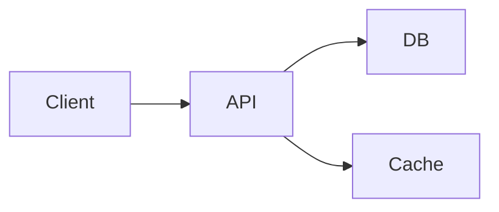

# Mermaid Animation Directives

Use this reference when a Mermaid source should carry its animation plan in Mermaid comments. The directive language is intentionally small: Mermaid still owns the diagram, and `%% @animate` comments describe how the rendered SVG should be revealed, moved, recolored, or annotated after Mermaid finishes rendering.

## Design Rules

- Keep every directive on one Mermaid comment line that starts with `%% @animate`.
- Preserve Mermaid geometry. Select rendered SVG elements or define points from rendered elements; do not restate the diagram layout.
- Prefer stable Mermaid IDs, labels, classes, and explicit aliases over DOM-order guesses.
- Use the same time value to run actions in parallel. Use later time values or `.end` references to sequence actions.
- Fail fast on unknown targets, points, verbs, malformed colors, or negative durations.
- Keep the final frame intentional: `show`, `reveal`, `move`, `color`, and `hide` persist unless the action says `restore=true`.

## Line Format

```text
%% @animate v1 [duration=<n>ms|<n>s] [default-duration=<n>ms|<n>s]
%% @animate target <name> = <selector>
%% @animate group <name> = <target-ref>[, <target-ref> ...]
%% @animate point <name> = <point-expr>
%% @animate mark <name> at <point-ref> [shape=dot|ring|label] [option=value ...]
%% @animate at <time-ref> <verb> <subject-ref> [argument ...] [option=value ...]
```

Names use lowercase letters, digits, and hyphens. Quote strings that contain spaces or punctuation:

```text
%% @animate target valid-payload = text:"Valid payload?"
```

## Selectors

Selectors identify Mermaid-rendered SVG elements. They intentionally mirror the existing order-token vocabulary from the animation CLI.

```text
#my-svg-node-id
id:my-svg-node-id
.class-token
role:node
role:edge
text:"Visible label"
css:"#stable-id"
css:".stable-class"
```

Use `--list-elements` first when the selector is not obvious. `css:` is the escape hatch for generated diagrams with no stable IDs or labels; the current processor intentionally supports only `#id`, `.class`, `tag`, and `tag.class` forms so directives stay stable across Mermaid releases.

`text:"..."` is substring-based after normalization. This is convenient for labels embedded in rich SVG groups, but short values can overmatch. For example, `text:"/"` can match both `/` and `examples/`, and `text:"Product"` can match `ProductStatus`. Prefer exact IDs, longer label text, or class selectors when the text is short or duplicated.

## Points

Points are reusable coordinates in SVG viewBox space. A point can be absolute, percentage-based, derived from an element anchor, derived from an edge path, or offset from another point.

```text
%% @animate point start = xy(40, 120)
%% @animate point center = xy(50%, 50%)
%% @animate point source = client.right
%% @animate point target = api.left
%% @animate point halfway = mid(client.center, api.center)
%% @animate point callout = offset(api.top, 0, -24)
%% @animate point edge-mid = edge:path(0.5)
```

Supported anchors are `center`, `top`, `right`, `bottom`, `left`, `top-left`, `top-right`, `bottom-left`, `bottom-right`, `start`, and `end`. For paths, `path(0)` is the start and `path(1)` is the end.

## Timeline

Times use `ms` or `s`. A bare number means milliseconds.

```text
%% @animate at 0ms reveal client
%% @animate at 500ms reveal api
%% @animate at +200ms move request to api.left duration=700ms
%% @animate at request.end color api fill=#d3f9d8 stroke=#2b8a3e
%% @animate at request.end+150ms pulse api scale=1.04 duration=300ms
```

`+200ms` is relative to the previous directive start time. `<action-name>.end` starts when that named action completes. `<action-name>.end+150ms` starts after a named action plus an offset. If an action is not explicitly named, the subject name is used when that is unambiguous; otherwise add `name=<action-name>`.

## Verbs

`show`
: Make hidden elements visible with an effect. Options: `effect=fade|pop|draw|grow-arrow|slide-up|slide-left|zoom`, `duration`, `ease`.

`reveal`
: Alias for `show`. When the subject is a group, options include `mode=together|sequence` and `gap`.

`hide`
: Hide elements. Options match `show`.

`move`
: Move an existing target or mark to a point. Arguments: `to <point-ref>`. Options: `from=<point-ref>`, `via=<point-ref>[|<point-ref> ...]`, `duration`, `ease`, `orient=none|path`.

`color`
: Animate color state. Options: `fill`, `stroke`, `text`, `opacity`, `duration`, `ease`, `restore=true|false`.

`trace`
: Draw an edge or path from start to end without moving its layout. Options: `from=<point-ref>`, `to=<point-ref>`, `duration`, `ease`.

`pulse`
: Temporarily emphasize a target. Options: `scale`, `stroke`, `fill`, `duration`, `repeat`, `restore`.

`set`
: Apply a final non-animated state such as `opacity=0.4` or `display=none`. Use this sparingly because it changes the static final composition.

## Current Processor Scope

The script processes directives from `.mmd` and `.md` source files automatically. Use `--directives-file` when animating a pre-rendered SVG with `--svg-input`.

Implemented now:

- `target`, `group`, `point`, `mark`, and `at` directives.
- Absolute times, `+relative` times, `.end`, and `.end+offset` references.
- Points from `xy`, `%` viewBox coordinates, anchors, `mid`, `offset`, and `<target>:path(<0..1>)`.
- Overlay marks with `dot`, `ring`, and `label` shapes.
- `show`, `reveal`, `trace`, `move`, `color`, `pulse`, `hide`, and `set`.
- Multiple timed actions on the same mark or target through accumulated CSS animations.

Known limits:

- `css:` selectors are deliberately narrow; use `--list-elements` and stable IDs or text selectors first.
- A selector can resolve multiple SVG elements. This is useful for grouped reveals, but point expressions such as `target.center` require exactly one resolved element. Use a more specific selector for point anchors.
- Mermaid-generated relationship IDs must be copied from `--list-elements`; source-to-target intuition can be wrong when Mermaid normalizes relation direction.
- `orient=path` is accepted as language but movement currently interpolates through SVG points and `via=` waypoints.
- `restore=true` is implemented for `color` and `hide`; persistent move and final color state rely on CSS animation fill mode.
- A rendered SVG element can have only one reveal/trace directive. Use later `move`, `color`, `pulse`, `hide`, or `set` actions for follow-up changes.
- Diagram-specific semantic selectors such as `edge:Decision->API`, `message:"Submit order"`, `state:Draft`, and `point:"Manual triage"` are recommended refinements, not current syntax.

## Marks

Marks create lightweight overlay elements that are not part of the original Mermaid diagram. Use them for moving tokens, cursors, packets, highlights, and callouts.

```text
%% @animate mark request at client.right shape=dot size=8 fill=#1971c2
%% @animate mark cursor at xy(0%, 0%) shape=ring size=14 stroke=#f08c00 opacity=0
%% @animate mark note at offset(api.top, 0, -28) shape=label text:"retry" fill=#fff3bf stroke=#f08c00
```

Marks are hidden until their first `show`, `reveal`, or `move` action unless `visible=true` is set.

## Minimal Example



## Implementation Notes

- Parse directives after Mermaid source extraction and before final SVG animation planning.
- Resolve aliases after the static SVG exists, because selectors and element anchors depend on Mermaid-rendered output.
- Convert `show`, grouped `reveal`, and `trace` to the existing candidate timing model when possible.
- Add overlay marks in a dedicated SVG layer above Mermaid content, with stable IDs derived from mark names.
- Apply movement, color, pulse, and hide actions as generated CSS animations injected into the SVG.
- Keep `prefers-reduced-motion` support: the final state must render correctly when animation is disabled.

## Diagram Agent Notes

For diagram-specific selector and choreography guidance, read `diagram-directive-notes.md`. It covers the Mermaid diagram types represented in the local example gallery and separates current syntax from future semantic selector ideas.

Flowcharts
: Natural targets are node labels and `role:edge`. The largest gap is stable edge selection; add a future `edge:<source>-><target>` selector instead of relying on DOM order. Groups should stay flat for now, but future group nesting would help represent paths.

State diagrams
: Anchors such as `draft.right` and `review.left` work well for token movement. State workflows need a first-class `wait` or `dwell` verb and selectors such as `state:Draft`, `state:[*].start`, `state:[*].end`, and `transition:Draft->Review`.

Sequence diagrams
: Participant labels may appear at both the top and bottom of the SVG, so exact IDs from `--list-elements` are currently safer for points. Add future selectors such as `participant:U`, `message:1`, `message:"Submit order"`, and synchronization helpers such as `all(validate.end, reserve.end)`.

Quadrant charts
: Data-point groups work with `text:"Label"` and `.center` anchors. Future syntax should separate plot-space and SVG-space with `plot(0.82, 0.76)`, `point:"Assisted routing"`, and scoped anchors such as `.symbol`, `.label`, and `.group-center`.
