# Codex Skills Repository

This repository is the source of truth for a curated backlog of Codex skills, their reusable resources, and their validation fixtures. The canonical skill source lives under `.agents/skills/`; `SKILLS.md` remains the authoritative backlog and status log.



## Repository Layout

| Path | Purpose |
| --- | --- |
| `.agents/skills/` | Canonical skill directories. Each skill has `SKILL.md` and optional `references/`, `scripts/`, `assets/`, and `agents/`. |
| `SKILLS.md` | Backlog, status, expected resources, and validation notes for every skill. |
| `scripts/` | Repository-level validators and builders. |
| `evaluations/` | Durable evaluation notes and summaries. Local bulky runs stay ignored under `evaluations/runs/`. |
| `projects/` | Project-scoped private workspaces. Each subfolder is a stable project ID with scripts, source notes, and generated artifacts under `artifacts/`. |
| `assets/readme/diagrams/` | Mermaid sources plus generated static and animated SVG diagrams used by this README. |
| `output/`, `docs/`, `examples/` | Disposable legacy scratch output or generated GitHub Pages output; these are ignored by git. |

## Skill Status

All current skills are marked `done` in `SKILLS.md`.

| Skill | Status | Use When |
| --- | --- | --- |
| [mermaid-animated-svg](.agents/skills/mermaid-animated-svg/SKILL.md) | `done` | Render Mermaid diagrams to static and animated SVG while preserving Mermaid geometry. |
| [d3-animated-svg](.agents/skills/d3-animated-svg/SKILL.md) | `done` | Build bespoke D3-generated SVG visualizations and galleries. |
| [echarts-animated-svg](.agents/skills/echarts-animated-svg/SKILL.md) | `done` | Animate already-rendered Apache ECharts SVG output. |
| [animated-svg-to-gif](.agents/skills/animated-svg-to-gif/SKILL.md) | `done` | Convert animated SVG assets into browser-rendered GIFs. |
| [slidev-animejs](.agents/skills/slidev-animejs/SKILL.md) | `done` | Build and validate Anime.js animation patterns inside Slidev decks. |
| [slidev-echarts](.agents/skills/slidev-echarts/SKILL.md) | `done` | Build and validate ECharts chart labs inside Slidev decks. |
| [slidev-quality-audit](.agents/skills/slidev-quality-audit/SKILL.md) | `done` | Audit Slidev decks for visual quality regressions. |
| [slidev-video](.agents/skills/slidev-video/SKILL.md) | `done` | Record, export, and validate Slidev decks as video. |
| [html-d3-anime-video-workflow](.agents/skills/html-d3-anime-video-workflow/SKILL.md) | `done` | Produce standalone HTML+D3+Anime.js video workflows. |
| [manim-svg-video](.agents/skills/manim-svg-video/SKILL.md) | `done` | Compose many SVG or animated SVG assets into a Manim-rendered MP4. |
| [threejs-animated-3d](.agents/skills/threejs-animated-3d/SKILL.md) | `done` | Build and verify browser-rendered Three.js/WebGL scenes. |

## Validation Flow



Before publishing changes, run:

```powershell
uv run --script scripts/validate-skills.py
uv run --script scripts/check-repo-payload.py
```

Run skill-specific checks whenever a skill, fixture, or script changes. For the AI concept video project scripts, use:

```powershell
node projects/ai-concept-videos/scripts/validate-concepts.mjs
```

## Publishing Notes

Use `uv run --script scripts/build-pages.py` after changing examples that should be published to GitHub Pages. Keep generated media, screenshots, local builds, and heavyweight evaluation runs out of git unless they are intentionally small fixture assets. Project deliverables belong under `projects/<project-id>/artifacts/`.
