# Codex Skills Repository: usage and operations

This working-copy guide retains pre-existing local changes that are not part of the published documentation commit. Validate local implementation before publishing those changes.

Run commands from the repository root unless a different working directory is shown.

This repository is the source of truth for a curated backlog of Codex skills, their reusable resources, and their validation fixtures. The canonical skill source lives under `skills/`; `SKILLS.md` remains the authoritative backlog and status log.



## Repository Layout

| Path | Purpose |
| --- | --- |
| `skills/` | Canonical skill directories. Each skill has `SKILL.md` and optional `references/`, `scripts/`, `assets/`, and `agents/`. |
| `.agents/skills/` | Ignored repository-local installation copied from `skills/`; never use it as canonical source. |
| `SKILLS.md` | Backlog, status, expected resources, and validation notes for every skill. |
| `scripts/` | Repository-level validators and builders. |
| `evaluations/` | Durable evaluation notes and summaries. Local bulky runs stay ignored under `evaluations/runs/`. |
| `projects/` | Project-scoped private workspaces. Each subfolder is a stable project ID with scripts, source notes, and generated artifacts under `artifacts/`. |
| `assets/readme/diagrams/` | Mermaid sources plus generated static and animated SVG diagrams used by this README. |
| `output/`, `dist/pages/`, `examples/` | Disposable scratch output and generated GitHub Pages files; these remain ignored. Authored guides live in tracked `docs/`. |

## Local Skill Installation

Keep source changes under `skills/`. Refresh the ignored repository-local installation after cloning or changing skill sources:

```powershell
uv run --script scripts/sync-local-skills.py
uv run --script scripts/sync-local-skills.py --check
```

The synchronizer updates source-owned files under `.agents/skills/` and leaves additional locally installed skills and files untouched.

## Example Catalog

Published examples must be referenceable by a stable ID and listed from the main GitHub Pages index generated by `scripts/build-pages.py`.

- Add each published example set to `PUBLISHED_EXAMPLE_SETS` with lowercase hyphen-case `id`, `source`, `href`, title, kind, and description.
- Use the same ID in validation notes, gallery DOM attributes, pattern references, and generated Pages links.
- Keep raw support folders out of the main page only when they are recorded in `UNLISTED_EXAMPLE_SOURCES`.
- For multi-item galleries, expose a stable ID per item through `id`, `data-example-id`, `data-pattern-id`, `data-chart-type`, or an equivalent attribute that verification scripts can inspect.

## Skill Status

This table highlights current skill status; `SKILLS.md` is authoritative.

| Skill | Status | Use When |
| --- | --- | --- |
| [mermaid](../skills/mermaid/SKILL.md) | `done` | Select, create, style, render, and animate Mermaid diagrams with colorset1 by default or extended colorset2 on request. |
| [d3](../skills/d3/SKILL.md) | `validating` | Create, animate, inspect, recompose, and validate D3 visuals and parametric SVG logos with colorset1 by default. |
| [procedural-svg-animation](../skills/procedural-svg-animation/SKILL.md) | `done` | Build deterministic standalone SVG motion systems from reusable procedural techniques. |
| [echarts-animated-svg](../skills/echarts-animated-svg/SKILL.md) | `done` | Animate already-rendered Apache ECharts SVG output. |
| [animated-svg-to-gif](../skills/animated-svg-to-gif/SKILL.md) | `done` | Convert animated SVG assets into browser-rendered GIFs. |
| [slidev-animejs](../skills/slidev-animejs/SKILL.md) | `done` | Build and validate Anime.js animation patterns inside Slidev decks. |
| [slidev-echarts](../skills/slidev-echarts/SKILL.md) | `done` | Build and validate ECharts chart labs inside Slidev decks. |
| [slidev-quality-audit](../skills/slidev-quality-audit/SKILL.md) | `done` | Audit Slidev decks for visual quality regressions. |
| [video](../skills/video/SKILL.md) | `done` | Orchestrate specialist visuals, compose mixed-media interactions, and render validated video at exact dimensions. |
| [manim-svg-video](../skills/manim-svg-video/SKILL.md) | `done` | Render standalone SVG-only sequences as manifest-backed Manim MP4s. |
| [threejs-animated-3d](../skills/threejs-animated-3d/SKILL.md) | `done` | Build and verify browser-rendered Three.js/WebGL scenes. |

## Validation Flow



Before publishing repository changes, run:

```powershell
uv run --script scripts/validate-skills.py
uv run --script scripts/check-repo-payload.py
uv run --script scripts/test-pi-eval-harness.py
```

`validate-skills.py` also checks that published example sets have unique IDs and are registered for the main examples page.

When a skill changes, also run a skill-only forward validation with `pi`. The normal runtime profile copies only that skill bundle and excludes large acceptance fixtures under `assets/examples/`:

```powershell
uv run --script scripts/run-pi-skill-eval.py <skill-name> --prompt-file evaluations/pi-prompts/<prompt>.md --mode json --strict --expect-output <artifact>
```

Use Spark as the default validation model through `openai-codex/gpt-5.3-codex-spark`, which is the helper default. The validation should prove that an agent with only the target skill can create the requested result, with no required references to repository docs, sibling skills, parent directories, or hidden workspace context.

See [evaluations/README.md](../evaluations/README.md) for the full case taxonomy, repetition policy, release gates, failure classification, and evidence-retention method.

After a JSON-mode run, inspect what the harness read:

```powershell
uv run --script scripts/summarize-pi-json-events.py evaluations/runs/<run-id>/events.jsonl --require-model gpt-5.3-codex-spark --fail-on-invalid-json --fail-on-tool-error
```

Passing skill validation requires more than a zero exit code:

- Required artifacts must be created at the exact requested paths; use `--expect-output` to enforce this.
- Generated artifacts must be inspected with the right validator for the medium, such as Playwright screenshots for browser visuals, `ffprobe` for media, or a skill-specific script.
- Runtime traces should read only `SKILL.md` and the focused in-skill references, scripts, templates, or small vendor files needed for the task.
- If a runtime run reads a large gallery, `assets/examples/`, project artifacts, or repository-level docs, split the reusable pattern into compact in-skill references or add simpler templates/scripts before marking the skill done.

Run skill-specific checks whenever a skill, fixture, or script changes. For the AI concept video project scripts, use:

```powershell
node projects/ai-concept-videos/scripts/validate-concepts.mjs
```

## Publishing Notes

Use `uv run --script scripts/build-pages.py` after changing examples that should be published to GitHub Pages. Keep generated media, screenshots, local builds, and heavyweight evaluation runs out of git unless they are intentionally small fixture assets. Project deliverables belong under `projects/<project-id>/artifacts/`.
