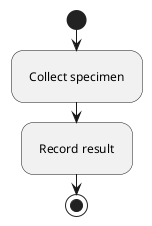

Render the following source with colorset1 using the available local plantuml
CLI. Save the exact source in input/diagram.puml, the result in
rendered/svg/diagram.svg, and render evidence in report.json. Preserve the
explicit authored style.

Treat skills/plantuml-colorset-renderer/ as read-only. Write all task files in
the current workspace. Use local tools without network access or other repositories.
Validate the required outputs before finishing.
