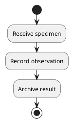

Write input/diagram.puml with this source:



Execute this exact command using the available local plantuml CLI:

Run the fenced command as its own shell call, separate from writing or validation.

```bash
uv run --script skills/plantuml-colorset-renderer/scripts/render_plantuml_directory.py input --output rendered --colorset colorset1 --format svg --engine cli --report report.json
```

Required outputs: input/diagram.puml, rendered/svg/diagram.svg, report.json.
Treat skills/plantuml-colorset-renderer/ as read-only. Write all task files in
the current workspace. Use local tools without network access or other repositories.
