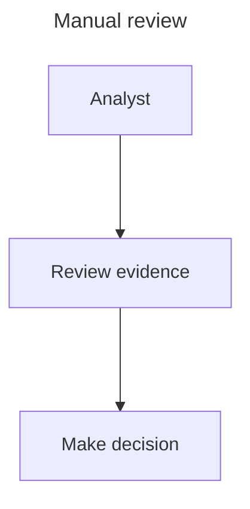

Restyle this existing Mermaid workflow with the skill's standard palette while preserving the explicitly chosen spacing, curve, text, and relationships. Do not render it; rendering is delegated to the evaluator.

Create `deliverables/manual-review.mmd` and a validation report at `deliverables/check.json`. Treat `skills/mermaid/` as read-only, keep generated files inside this workspace, and use only the copied skill and ordinary local tools. Do not read acceptance examples or external repositories.
