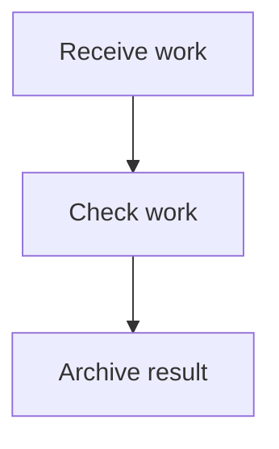

Apply the installed Mermaid skill to this source without changing its labels or topology:



Create `deliverables/diagrams/intake.mmd`, run the normal default styling, and create `deliverables/style.json`. Then run this exact command:

```sh
uv run --script skills/mermaid/scripts/style_mermaid_directory.py deliverables/diagrams --check --require-accessibility --report deliverables/check.json
```

Rendering is delegated to the evaluator. Use only the copied skill and ordinary local tools. Treat `skills/mermaid/` as read-only, keep generated files in this workspace, and do not read acceptance examples or external repositories.
