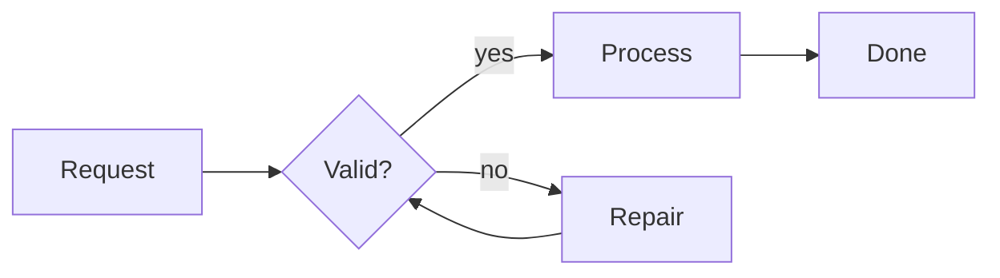

Create a portable animated SVG from a small Mermaid flowchart.

Requirements:

- Use the `mermaid-animated-svg` skill.
- Work only from the copied skill and the prompt. Do not look outside the workspace.
- Create exactly `flow.mmd` with this Mermaid source:

- Use the skill script to generate exactly `flow.static.svg` and `flow.animated.svg`.
- Use `--animation auto`, `--duration-ms 700`, and `--stagger-ms 100`.
- Verify that the exact file `flow.animated.svg` exists, contains an inline `<svg>`, contains animation metadata or animation CSS, and keeps the labels `Request`, `Valid?`, `Process`, `Repair`, and `Done`.
- Keep outputs in the workspace root. Do not write generated task files inside `skills/mermaid-animated-svg/`.
- At the end, print a concise summary of files created and validation checks.
