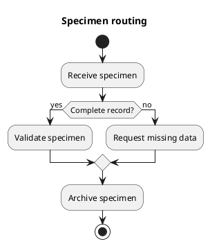
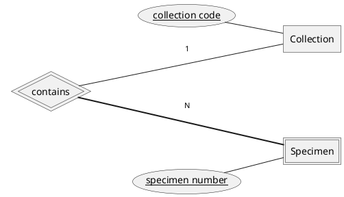
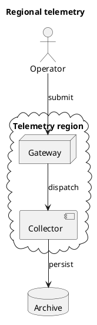

Render a small public synthetic dossier locally with the loaded PlantUML skill.
Keep all labels, relations, cardinalities, and source styles below intact. Use
the skill's default colorset. Deliver SVG and PNG for every source. Native
category bodies should be opaque solid fills without decorative outlines;
meaningful weak-entity boundaries, compartments, line art, and connectors must
remain visible. Text must be exactly black or white according to its actual
painted backing, and directional shafts and complete heads must have at least
3:1 contrast against every crossed backing.

Save exactly `input/activity.puml`:



Save exactly `input/chen.puml`:



Save exactly `input/deployment.puml`:



Execute this exact command as its own shell call, separate from writing files
or validating them. The normal local `plantuml` command is available on PATH.

```bash
uv run --script skills/plantuml-colorset-renderer/scripts/render_plantuml_directory.py input --output rendered --format svg --format png --engine cli --report render-report.json
```

Run the bundled report validator and save its JSON result at `validation.json`.
Confirm that the PNG outputs derive from the finished SVG. Write `review.md`
with a concise inspection of source semantics, weak-entity notation, actor
line art, text backings, and arrow contrast. Inspect each delivery format.

Required outputs are `input/activity.puml`, `input/chen.puml`,
`input/deployment.puml`, `rendered/svg/activity.svg`, `rendered/png/activity.png`,
`rendered/svg/chen.svg`, `rendered/png/chen.png`, `rendered/svg/deployment.svg`,
`rendered/png/deployment.png`, `render-report.json`, `validation.json`, and
`review.md`.

Treat `skills/plantuml-colorset-renderer/` as read-only. Write task files in this
workspace. Use only the loaded skill and normal local tools. Do not read
acceptance fixtures, sibling skills, repository documents, harness metadata,
ancestor Git state, or parent files other than the supplied prompt. Do not use
network access.
