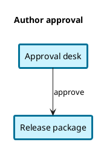
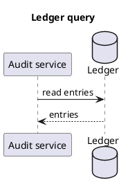

Render these two public synthetic PlantUML sources locally in colorset2. Keep
the exact source files and every label and relation intact. The first source
has intentional authored padding, a pale-blue surface, and a 3 px blue border;
preserve those explicit overrides. The second source uses normal native theme
presentation: retain the database silhouette, its internal arc, and the message
directions. Its exterior labels should use their actual canvas backing.

Save exactly `input/authored-style.puml`:

Save exactly `input/sequence-database.puml`:

Deliver exactly `rendered/svg/authored-style.svg`,
`rendered/png/authored-style.png`, `rendered/svg/sequence-database.svg`, and
`rendered/png/sequence-database.png`, with output root `rendered`. Save render
evidence in `render-report.json` and the bundled report validator's JSON result
in `validation.json`. Request both SVG and PNG, render through the normal local
`plantuml` command on PATH, and confirm the PNG outputs derive from the finished
SVG.

Keep native category bodies opaque and borderless except for intentional
authored styling or meaningful notation. Choose exactly black or white for
text by contrast against its actual backing. Directional shafts and complete
heads must have at least 3:1 contrast against every crossed backing. Inspect
both delivery formats and record the actual overrides, database details, label
backings, and message direction in `review.md`.

Treat `skills/plantuml-colorset-renderer/` as read-only. Write all task files in
this workspace. Use only the loaded skill and normal local tools. Do not read
acceptance fixtures, sibling skills, repository documents, harness metadata,
ancestor Git state, or parent files other than the supplied prompt. Do not use
network access.
