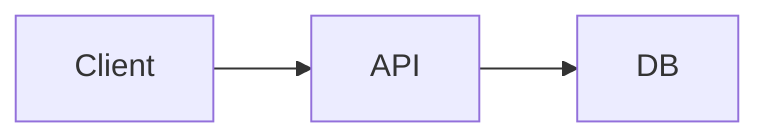

# Mermaid SVG Animation

Animate Mermaid-rendered SVG rather than rebuilding its geometry. Use `scripts/animate_mermaid_svg.py`; the static SVG remains the source of truth for layout, text, classes, edge paths, markers, and final colors.

## Basic Workflow

1. Render the styled Mermaid source and retain a static SVG.
2. Start with `--animation auto`.
3. Use `--list-elements` before custom selectors or reveal order.
4. Prefer label, ID, generated class, and role selectors over DOM positions.
5. Compare the final animated frame with the static SVG and verify reduced-motion behavior.

```powershell
uv run --script skills/mermaid/scripts/animate_mermaid_svg.py diagram.mmd -o diagram.animated.svg --static-output diagram.static.svg --animation auto --duration-ms 650 --stagger-ms 120
```

For an existing static Mermaid SVG:

```powershell
uv run --script skills/mermaid/scripts/animate_mermaid_svg.py --svg-input diagram.static.svg -o diagram.animated.svg --animation organic
```

## Presets and Timing

`--animation` accepts `auto`, `sequence`, `organic`, `ishikawa`, `mindmap-level`, `mindmap-branch`, `fade`, `draw`, `pop`, `slide-up`, `slide-left`, `zoom`, and `none`.

Use `auto` unless the user requests a style. It applies family-aware construction order for flowcharts, swimlanes, states, ER, class, block, architecture, event modeling, Sankey, GitGraph, TreeView, Kanban, quadrant, pie, radar, Gantt, journey, mindmap, Ishikawa, Venn, and timeline; other families fall back to a safe sequence.

General controls:

- `--duration-ms`: duration per element.
- `--stagger-ms`: delay between elements.
- `--initial-delay-ms`: delay before construction.
- `--total-ms`: fit the sequence into a target duration when dependency ordering permits it.
- `--easing`: CSS timing function.
- `--draw-distance`: temporary path dash distance.

Family-specific controls include `--state-dwell-ms`, `--state-dwell`, `--flowchart-dwell-ms`, `--flowchart-dwell`, mindmap branch/radial timing, and Ishikawa branch timing. Use `--help` for the exact option contract rather than copying every switch into a task prompt.

## Ordering and Selectors

Order tokens may be exact IDs, `#id`, `.class`, `role:node`, `role:edge`, `text:Label`, visible label text, or stable ID/class fragments. Prefer tokens emitted by `--list-elements`.

```powershell
uv run --script skills/mermaid/scripts/animate_mermaid_svg.py diagram.mmd -o diagram.animated.svg --animation sequence --order "Start,Validate,Process,Done" --strict-order
```

Use a JSON array or newline-separated `--order-file` for long sequences. A short text selector can overmatch; use a longer label or exact ID when labels repeat.

## Mermaid Comment Directives

Use `%% @animate` comments when the source should carry choreography. Keep Mermaid responsible for geometry and describe only targets, points, marks, and time.

```text
%% @animate v1 [duration=4s] [default-duration=500ms]
%% @animate target <name> = <selector>
%% @animate group <name> = <target-ref>[, <target-ref> ...]
%% @animate point <name> = <point-expr>
%% @animate mark <name> at <point-ref> [shape=dot|ring|label] [option=value ...]
%% @animate at <time-ref> <verb> <subject-ref> [argument ...] [option=value ...]
```

Selectors include `#id`, `id:id`, `.class`, `role:node`, `role:edge`, `text:"Visible label"`, and narrow `css:` selectors. Point expressions include `xy(x,y)`, percentages, target anchors such as `.left` or `.right`, `mid(a,b)`, `offset(point,dx,dy)`, and `target:path(0..1)`.

Implemented verbs are `show`, `reveal`, `hide`, `move`, `color`, `trace`, `pulse`, and `set`. Times accept `ms`, `s`, `+relative` offsets, and named action `.end` references.

Minimal example:



Use overlay marks for moving tokens, cursors, highlights, and callouts so the Mermaid layout remains unchanged. Fail fast on unknown targets, malformed points, invalid colors, or negative durations.

## Final-Frame Checks

- The animated SVG contains inline animation CSS or metadata and no external JavaScript dependency.
- Every requested selector resolves; use `--strict-order` for exact choreography.
- Nodes appear before dependent connectors when semantic order matters.
- Arrowheads become visible with their lines rather than floating early.
- The final frame preserves all static labels, markers, geometry, theme variables, and custom CSS.
- `prefers-reduced-motion` exposes a complete, readable final state.

