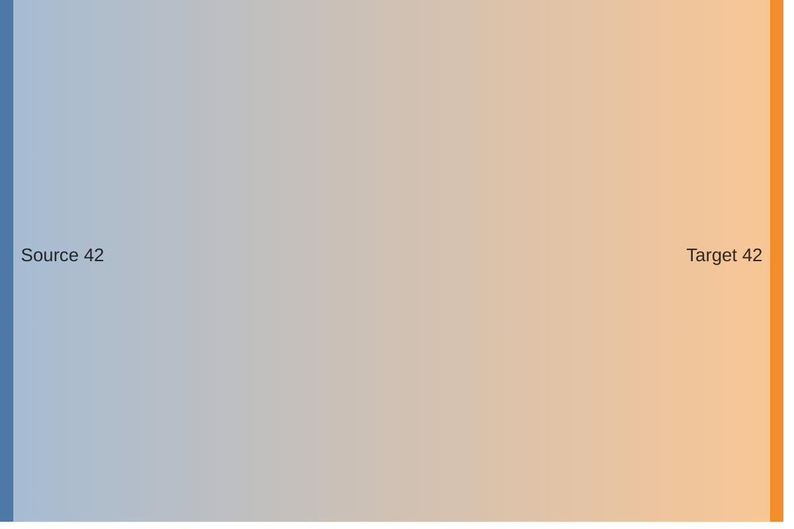
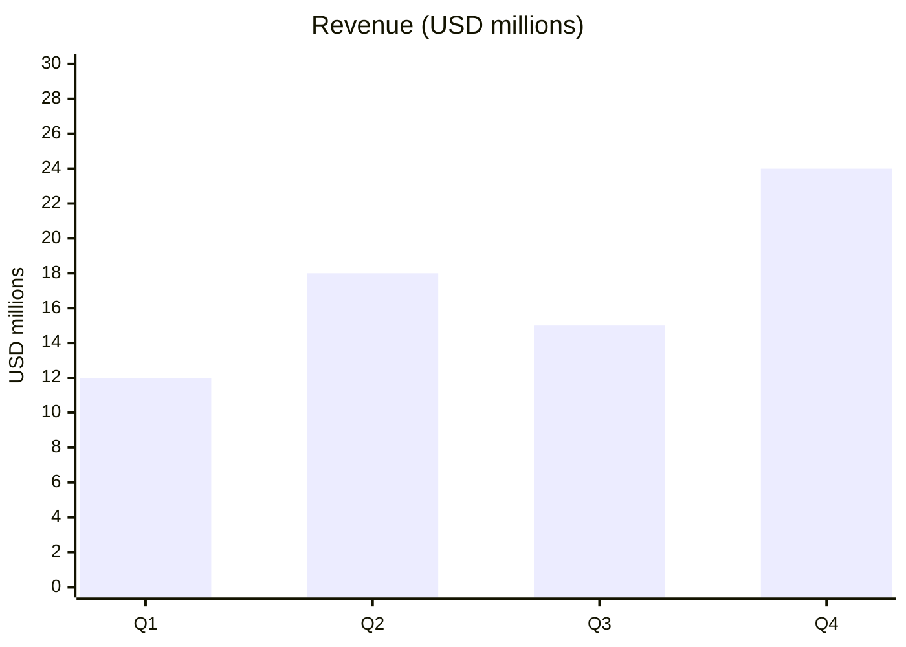
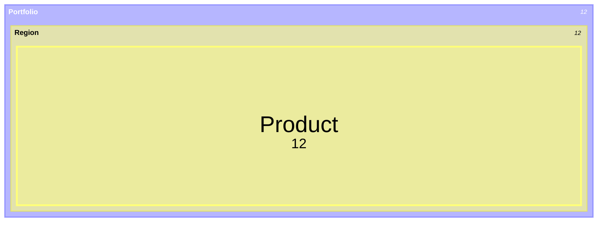
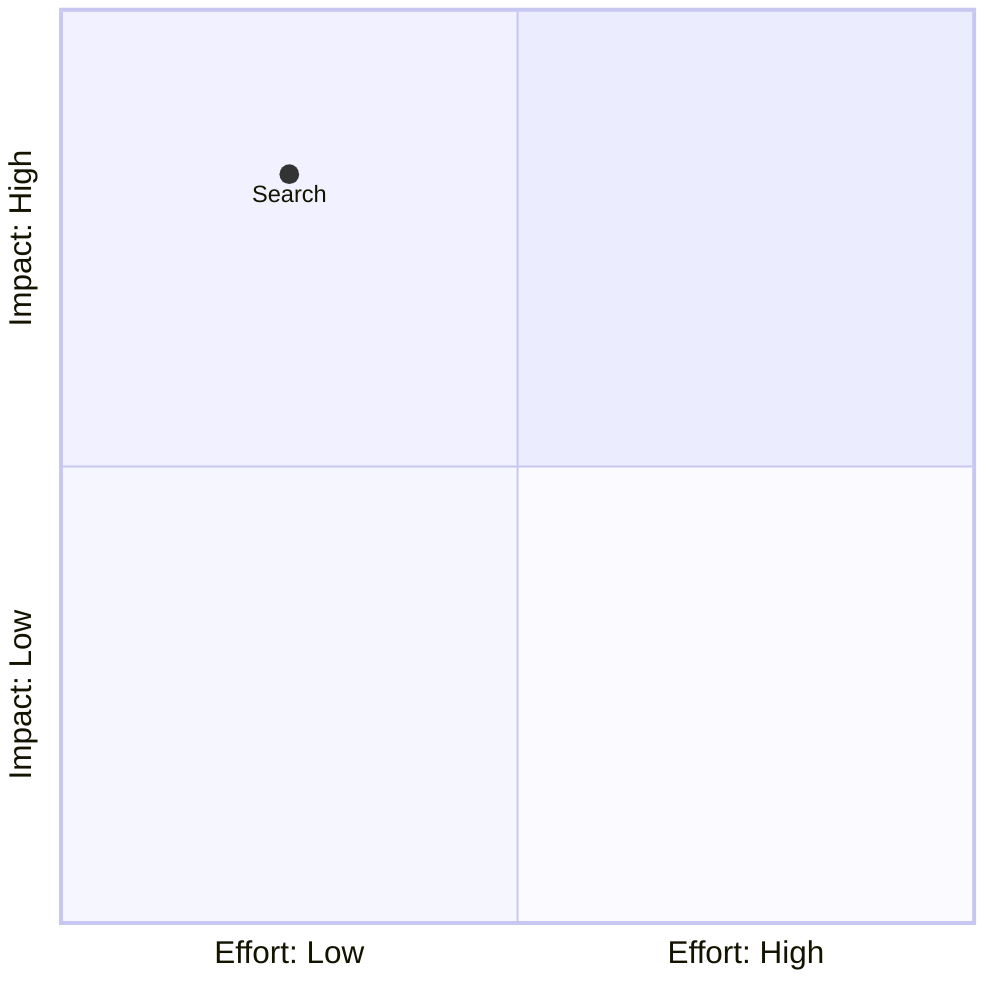
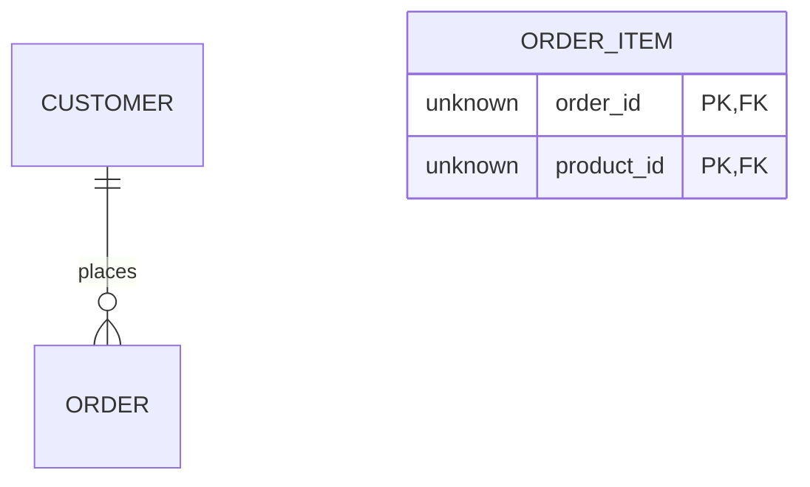
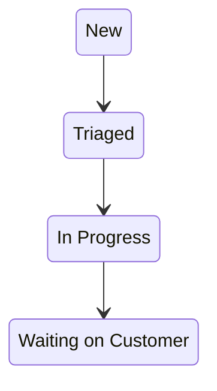
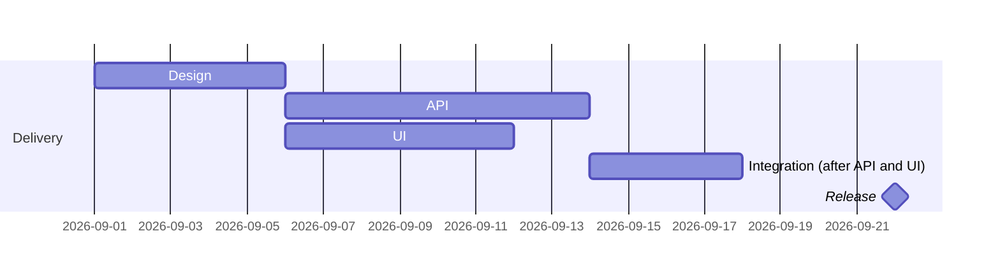

# Mermaid Diagram Selection and Authoring

Choose a diagram by the relationship the viewer must decode. File shape is weak evidence: rows can describe a process, event stream, schema, schedule, hierarchy, or quantitative series.

## Selection Priority

1. Honor a usable explicit type.
2. Identify the primary question: order, interaction, state, structure, schedule, hierarchy, quantity, flow, overlap, causality, or placement.
3. Preserve the data contract. Reject a family that would discard direction, time, weight, cardinality, or hierarchy.
4. Prefer a stable, common family when two choices communicate equally well.
5. Use beta or specialized families only when their semantics materially improve the result and Mermaid 11.16.0 supports the declaration.

## Decision Matrix

| Input meaning or viewer question | Prefer | Declaration | Key distinction |
| --- | --- | --- | --- |
| Steps, decisions, routing, dependencies | Flowchart | `flowchart` | Use for logical order; `LR` for pipelines and `TB` for layered decomposition. |
| Process steps partitioned by owner or team | Swimlane | `swimlane-beta` | Use only when responsibility lanes are the point. |
| Messages between actors in temporal order | Sequence | `sequenceDiagram` | Preserve caller, callee, direction, and response order. |
| Valid statuses and transitions | State | `stateDiagram-v2` | Use for lifecycle rules, not merely chronological events. |
| Tables/entities with keys and cardinalities | Entity relationship | `erDiagram` | Preserve optionality and one/many relationships. |
| Classes, members, inheritance, composition | Class | `classDiagram` | Use for type structure rather than stored records. |
| Tasks with dates, durations, milestones, dependencies | Gantt | `gantt` | Requires a real time scale or schedule. |
| Events ordered by date without task duration | Timeline | `timeline` | Use for chronology, not a workflow. |
| User stages with tasks, actors, or satisfaction scores | Journey | `journey` | Use when experience across stages is the message. |
| Categories as parts of one total | Pie | `pie` | Use only for nonnegative parts of a common whole, preferably six or fewer. |
| Numeric values by category or ordered x-domain | XY chart | `xychart` | Use bars for comparisons and lines for ordered trends. |
| Several measures describing comparable profiles | Radar | `radar-beta` | Use a shared scale and at least three axes. |
| Weighted source-to-target movement | Sankey | `sankey` | Preserve source, target, and magnitude; do not substitute a flowchart. |
| Items positioned against two named axes | Quadrant | `quadrantChart` | Requires meaningful x/y coordinates or ranks. |
| Nested topics or conceptual decomposition | Mindmap | `mindmap` | Use when hierarchy and association matter more than exact values. |
| File/folder or strict tree navigation | TreeView | `treeView-beta` | Use for parent-child trees with directory-like reading. |
| Quantitative hierarchy where area represents value | Treemap | `treemap-beta` | Every leaf value must have the same unit. |
| Work cards grouped by status | Kanban | `kanban` | Use when board state, not transition rules, is the message. |
| Git branches, commits, merges, releases | Git graph | `gitGraph` | Preserve branch and merge history. |
| System services, groups, and connections | Architecture | `architecture-beta` | Use for service topology and deployment-style relations. |
| Explicit C4 abstraction and boundaries | C4 | `C4Context`, `C4Container`, `C4Component`, `C4Dynamic`, or `C4Deployment` | Use only when the requested level is genuinely C4. |
| Schematic blocks or constrained block layout | Block | `block` | Prefer flowchart for ordinary processes. |
| Requirements, elements, verification, trace links | Requirement | `requirementDiagram` | Preserve IDs, risks, verification methods, and relation types. |
| Set membership and overlaps | Venn | `venn-beta` | Use only when intersections are explicit. |
| Causes grouped toward one effect | Ishikawa | `ishikawa-beta` | Use for root-cause categories, not arbitrary trees. |
| Event-modeling commands, events, views, policies | Event Modeling | `eventmodeling` | Use when those domain roles are explicit. |
| Network packet bit fields | Packet | `packet` | Preserve offsets and widths. |
| Grammar productions or parser paths | Railroad | `railroad-beta` or its grammar-specific variant | Match the supplied grammar notation. |
| Value chain against evolution | Wardley | `wardley-beta` | Requires both value-chain position and evolution. |
| Clear/complicated/complex/chaotic domain placement | Cynefin | `cynefin-beta` | Use only for Cynefin classification. |
| Code-like interaction notation explicitly suited to ZenUML | ZenUML | `zenuml` | Otherwise prefer the standard sequence diagram. |

The table's declaration is Mermaid syntax, not necessarily the canonical family ID used in routing metadata. In particular, use `selectedFamily: "xyChart"` with `declaration: "xychart"` (or `"xychart-beta"`); never copy the lowercase declaration into `selectedFamily`.

## Ambiguity Rules

- Workflow versus sequence: choose flowchart for decisions and transformations; choose sequence when participant-to-participant messages over time are primary.
- Timeline versus Gantt: choose timeline for dated events; choose Gantt when duration, overlap, milestones, or dependencies matter.
- State versus Kanban: choose state for allowed transitions; choose Kanban for the current grouping of work items.
- Mindmap versus treemap: choose mindmap for concepts; choose treemap when area encodes a quantitative hierarchy.
- Flowchart versus Sankey: choose flowchart for logic; choose Sankey when link widths must represent amounts.
- ER versus class: choose ER for stored entities/cardinalities; choose class for software types and inheritance.
- Architecture versus C4: choose Architecture for general service topology; choose C4 only when C4 levels and boundaries are requested or supplied.
- Pie versus XY chart: choose pie only for one total. Use XY for independent values, negative values, many categories, or time trends.

If two families remain equally valid and the choice changes the message, state the assumption in the task result. Do not ask when one choice preserves materially more of the supplied data.

## Palette Contract

- `colorset1` is the standard: brand red (`#9e1b32`), dark ink (`#333e48`), white, and neutral grays. Use it when no palette mode is stated.
- `colorset2` is extended/full-color: it retains the brand anchors and adds blue (`#007298`), orange (`#e77204`), green (`#45842a`), cyan (`#00ace6`), and purple (`#652f6c`). Use it only after an explicit extended/full-color request.
- Use light fills with dark text. Do not use color as the only carrier of meaning; retain labels, shapes, edge text, or grouping.
- Use semantic classes sparingly: primary path (`csPrimary`), alternative emphasis (`csAccent`), de-emphasis (`csMuted`), failure (`csCritical`), caution (`csWarning`), success (`csSuccess`), information (`csInfo`), exceptional category (`csSpecial`), and neutral structure (`csNeutral`).

## Authoring Quality

- Keep one main claim per diagram. Split when unrelated relationships compete for attention.
- Preserve supplied human labels verbatim in the rendered diagram, including their original language, spelling, capitalization, and punctuation. Do not translate, paraphrase, or anglicize them unless the user requests it. Stable internal identifiers may use ASCII when the grammar requires them.
- Follow the selected family's label grammar; quoted labels are not valid transition operands in state diagrams.
- Preserve the supplied order unless the chosen family has a truthful semantic order of its own.
- Include units in titles, axis labels, edge labels, or nearby notes when values are otherwise ambiguous.
- Keep exact weights in Sankey links, exact dates/dependencies in Gantt, exact coordinates in Quadrant, exact cardinalities in ER, and exact transitions in State.
- Keep Quadrant axis endpoints as plain text without parentheses; Mermaid 11.16.0 rejects forms such as `x-axis Esfuerzo (bajo) --> Esfuerzo (alto)`. Use `x-axis Esfuerzo bajo --> Esfuerzo alto` instead.
- Do not append `:::cs...` classes to Quadrant points or add `classDef` rules for them. Mermaid 11.16.0 rejects point classes; rely on the colorset's Quadrant theme variables.
- Do not infer missing cardinality, duration, dependency, quantity, or direction. Mark uncertainty visibly or omit the unsupported relation.
- Use `LR` for short left-to-right flows and `TB` for hierarchies or flows that would become excessively wide.
- Render before delivery. Mermaid can exit successfully yet emit an error SVG for some invalid declarations, so inspect the SVG role/classes as well as the process code.

## Compact Data Syntax

Use these skeletons for families whose data grammar is easy to confuse. Replace the values; do not copy fixture facts.

After `sankey`, use only three-column CSV rows (`source,target,value`), comments, or blank lines. Do not put `title` or another diagram directive in the CSV body. When the values have a supplied unit, keep `showValues: true` and set a visible suffix in YAML, for example `config.sankey.suffix: " tonnes"`; do not rely on prose outside the deliverable.

Keep `x-axis` items as category labels only. Put numeric observations only in `bar` or `line`; never append values, signs, or units to category labels. Preserve signs and decimals in the numeric series.

In Treemap, quote every parent and leaf label, encode each leaf as `"Label": value`, and express hierarchy only through indentation. Put a supplied unit in the YAML title; do not add a `title` directive to the diagram body.

Quote each Quadrant axis endpoint separately. Mermaid 11.16.0 rejects an unquoted colon in an axis endpoint; separate quotes preserve punctuation and visible wording, for example `x-axis "Complexity: Low" --> "Complexity: High"`. Never quote the whole `left --> right` expression.

Every ER relationship requires a concise label after a colon, as in `CUSTOMER ||--o{ ORDER : places`; Mermaid 11.16.0 does not render an unlabeled relationship. Derive the label from the supplied relationship and do not invent a different semantic. Quote a multiword label, for example `: "belongs to"`; bare multiword labels such as `: belongs to` fail to parse. Either left-to-right orientation is valid when its cardinalities remain attached to the correct entities.

When reversing an ER relation, mirror its marker tokens: the reverse of `PARENT ||--o{ CHILD` is `CHILD }o--|| PARENT`, never `CHILD o{--|| PARENT`. On the left, zero-or-many is `}o`; on the right, it is `o{`.

Every ER attribute row requires `<type> <name> [keys]`. Preserve a supplied type exactly; when the input omits it, use the literal neutral type `unknown` instead of guessing. Separate multiple key constraints with a comma: `PK, FK`, never `PK FK`.

In state diagrams, every transition operand must be an identifier. For labels with spaces or punctuation, declare `state "Human label" as StableId` once and use only `StableId` in transitions; never write `"Human label" --> ...`.

In Gantt, give tasks stable IDs and use exactly one start expression per task. Put status tags before the ID, for example `:done, design, ...` or `:crit, review, ...`; never write `:design, done, ...`. For combined states, put `crit` first, then `active` or `done`, then the ID: `:crit, active, running_blocker, ...` and `:crit, done, finished_blocker, ...`. Mermaid 11.16.0 accepts one `after <id>` expression; never write a second `after` clause such as `after api, after ui`. For multiple prerequisites with known dates or durations, schedule after the prerequisite that finishes last and retain the complete dependency in the human label when it matters, for example `Integration (after API and UI): int, after api, 4d` when API finishes after UI. If the latest predecessor cannot be determined truthfully, surface the limitation instead of inventing an order.

When the input supplies task state, encode Mermaid's `done`, `active`, and `crit` tags so the state remains visually legible and the corresponding palette roles are actually rendered. Never invent task states merely to expose more colors.
