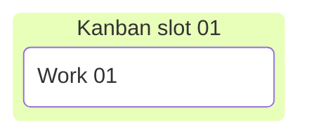
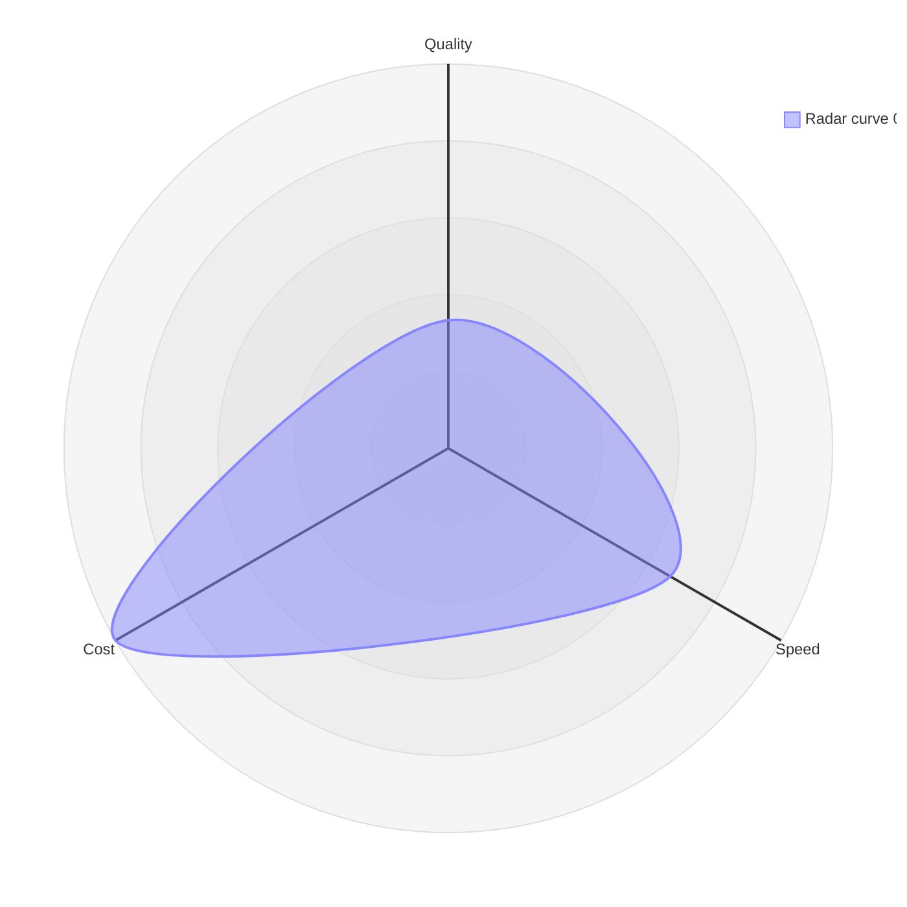
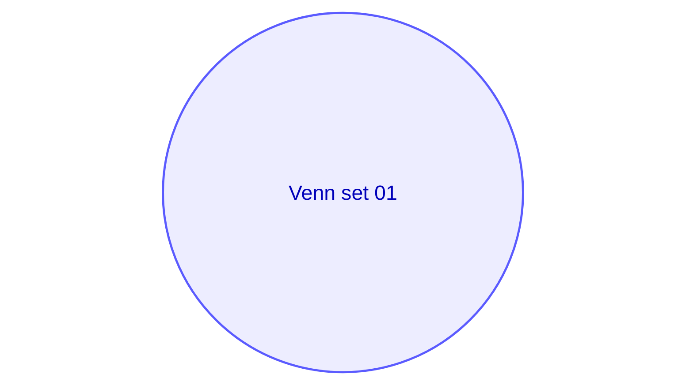

# Mermaid Palette Capacity

Use this reference for dense diagrams whose elements consume indexed or semantic color slots. The limits below are pinned to Mermaid 11.16.0. They describe the number of distinct generated style slots, not a general limit on nodes or data rows.

## Indexed slots

| Family | Capacity to exercise | Authoring consequence |
| --- | ---: | --- |
| Mindmap | 11 level-one branches plus the root | The root consumes `cScale0`; the 11 branch sections consume `cScale1` through `cScale11` before cycling. The visible capacity is 12 fills, not 14. |
| Timeline | 12 sections or unsectioned periods | The `cScale0` through `cScale11` sequence then cycles. |
| Radar | 12 curves | Curves beyond index 11 have no additional generated scale slot. |
| Treemap | 12 colored named hierarchy nodes | Mermaid's implicit parser root consumes the transparent ordinal entry. The next 12 distinct named groups consume `cScale0` through `cScale11`. If the source includes a named wrapper root, that wrapper consumes `cScale0`, so add at most 11 direct child groups before cycling. |
| Kanban | 10 colored columns | Rendered columns use classes `section-1` through `section-10`, which map to the lightened forms of `cScale2` through `cScale11`. The generated `section--1` and `section-0` rules for `cScale0` and `cScale1` are unreachable by columns in Mermaid 11.16.0. Split a wider board or add deliberate custom CSS. |
| Journey | 7 distinct sections, plus an eighth boundary section | Mermaid 11.16.0 cycles section classes through `0` to `6` because its default `sectionFills` has seven entries. Configure all exposed `fillType0` through `fillType7` variables, but expect section eight to reuse class `section-type-0`. |
| Pie | 12 slices | `pie1` through `pie12` are the complete slice scheme before reuse. |
| Venn | 8 sets | `venn1` through `venn8` are the complete set scheme before reuse. |
| GitGraph | 8 branches including the main branch | `git0` through `git7`, their inverse colors, and all eight branch-label colors must be configured together. |

The general Mermaid theme scale contains 12 entries. Configure `cScale`, `cScaleLabel`, and `cScaleInv` for all 12 entries whenever a family consumes that scale. Treemap also consumes all 12 `cScalePeer` entries.

Kanban columns and cards require stable IDs before bracketed labels. Bare multiword lines do not parse:

Radar axes and curves likewise require IDs before quoted bracketed labels:

Venn sets use a colon before the numeric size; `size 80` does not parse:

## Configured and semantic slots

- The generated Sankey node map uses eight colors and cycles only after eight distinct node IDs. Write comma-safe labels as unquoted CSV fields, for example `Transfer node 01,Transfer node 02,80`. Use CSV double quotes only when a label itself requires them; single quotes become visible label characters.
- The extended XY palette contains six plot colors; the standard palette contains five. A six-series acceptance case exercises both the extended tail and standard cycling behavior.
- Quadrant and Cynefin use four and five fixed domains respectively.
- Event Modeling uses five semantic element roles: UI, processor, read model, command, and event.
- Gantt has no maximum task count. Exercise normal, active, done, critical, active-critical, and done-critical tasks instead of inventing a node limit. Prefer `crit, active, id` and `crit, done, id` for combined states; Mermaid 11.16.0 also renders the reversed status order.
- Families for which `references/diagram-types.json` reports `classDef: true` can consume nine labeled roles: `csPrimary`, `csAccent`, `csMuted`, `csCritical`, `csWarning`, `csSuccess`, `csInfo`, `csSpecial`, and `csNeutral`. Use each role once to exercise the boundary; further elements may reuse roles by meaning.

Use the assignment form that the selected grammar renders:

- Flowchart and Swimlane nodes: `R01["Role 01"]:::csPrimary`.
- Class diagram declarations: `class ClassRole01:::csPrimary`. A separate `class ClassRole01 csPrimary` line is parsed as another class, not as styling.
- State, ER, Requirement, and Block elements: declare the element first, then use `class R01 csPrimary`. Block diagrams do not accept the inline `:::` form reliably.

At the full nine-role boundary, the styler adds compact Mermaid 11.16.0 layout defaults when no explicit family layout is present:

- ER uses `config.er.minEntityWidth: 180` and `rankSpacing: 20`; keep `direction TB` for a long linear chain. This prevents nine short entity IDs from rendering as an excessively narrow column.
- Swimlane uses `config.flowchart.nodeSpacing: 10` and `rankSpacing: 20`. Prefer `swimlane-beta TB` for three dense lanes unless left-to-right order is itself required; the compact LR form remains suitable when direction matters.

Explicit user layout settings take precedence. In State diagrams, an alias replaces the visible state ID. When the input supplies IDs without separate display labels, use the IDs directly; do not invent `state "Label" as ID` aliases that hide required visible terms.

For families with unlimited, uniformly styled elements, do not claim a finite maximum. Use multiple elements to prove parsing and layout, and validate every distinct visual role the family actually exposes.
