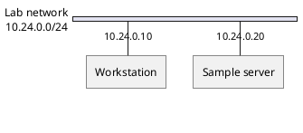
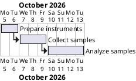

# Native NWDIAG and Gantt Authoring

Read this before generating network or schedule source from facts. These
families use their own grammar. Render through the bundled directory renderer
and inspect the actual labels and relationships in both SVG and PNG.

## NWDIAG aliases and displayed names

Use bare identifiers for network and server aliases. Put multiword names in a
`description` property inside the corresponding body. Do not quote the alias,
place properties in the network header, or replace the network name with a
page title. A title does not name a network.

Keep all supplied addresses and node/network display names exact. An alias is
only a source identifier. Verify that the network itself displays its required
name, each server displays its name and address, and the topology matches the
facts. The [official NWDIAG reference](https://plantuml.com/nwdiag) documents
body properties and the separate node-attribute syntax.

## Gantt durations and dependencies

Use task names in brackets and native duration clauses. A task that follows
another starts at that predecessor's end, using the exact possessive syntax.

Do not omit `'s end`, invent a `starts at [Task] end` clause, or substitute a
milestone for a task's duration. Preserve supplied start dates, durations and
dependency direction. Inspect bar lengths, date ticks and dependency heads in
the actual rendered schedule. Use `then` only when the requested facts describe
a sequential chain. The [official Gantt reference](https://plantuml.com/gantt-diagram)
documents the native date, duration and dependency forms.

## Exact rendering and validation APIs

Use `--engine cli` for the installed local renderer; accepted engine names are
`auto`, `cli`, `server`, and `kroki`. The bundled Python renderer resolves the
ordinary local command, including a Windows `.cmd` executable. Use the report's
engine field as evidence of the chosen rendering path.

Run `validate_plantuml_render_report.py` with `--report`, `--output` and
`--colorset`. It prints JSON to standard output; redirect that output to a
required JSON file. It has no `--write-json` option. Read `--help` only when an
unusual option is needed; do not invent CLI flags or rerender correctly
validated artifacts solely to repeat the same checks.
