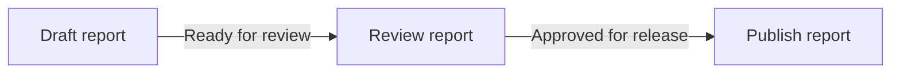
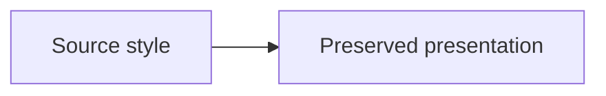

# Native Mermaid Defaults

Use this recipe when a Slidev deck contains Mermaid fences or needs visual continuity with the established Mermaid and PlantUML palettes. Install the setup once; keep each fence focused on diagram content.

## Install into the target deck

Copy [`assets/templates/slidev-diagram-style/`](../assets/templates/slidev-diagram-style/) into the requested deck root. The self-contained pack ships `diagram-style.mjs`, `setup/mermaid.ts` and `setup/mermaid-renderer.ts`; it needs no sibling skill or acceptance fixture. For existing Mermaid setup hooks, merge the bundled configuration and rendering behavior while preserving functional options and explicit user presentation. Do not overwrite unrelated setup files.

The renderer hook applies that selected configuration at render time so Slidev theme toggles keep the declared palette. The setup hook uses `defineMermaidSetup` from `@slidev/types` and `mermaidColorsetConfig('colorset1')` from `../diagram-style.mjs`. Keep colorset1 as the default. Change the selected argument to `'colorset2'` only for an explicit extended/full-color request. Keep the deck's diagram canvas white; the setup chooses label contrast against that actual canvas. Set the deck font with `fonts.sans: Open Sans` and keep that font available in export.

Write plain Mermaid source without a repeated theme, init directive or generated `classDef` in every fence:



The generated setup uses Mermaid's base theme, primary red `#9e1b32`, interleaved black/grays for indexed categories, solid bodies without decorative outlines, black/white inside labels and neutral connectors. The same palette names and exact tokens apply to Mermaid, authored Anime.js marks and imported PlantUML diagrams that already follow the selected palette. Default semantic roles and fixed indexed slots keep the same paints across slides. Native indexed families assign colors by slot; reordering their categories can change the color of an identity. Keep category order or explicit semantic mappings consistent when identity continuity matters. Semantic relations, compartments, actor line art and explicit user styles remain meaningful.

## Preserve explicit source presentation

Keep the shared default for ordinary fences. When the user explicitly requests a supplied diagram's different paint, borders or theme, use the per-fence source escape:

````markdown

````

That mode uses native Mermaid rendering and bypasses colorset configuration, caption CSS and native label finishing for the selected diagram. Report an incompatible source palette instead of claiming a colorset pass. In normal mode, the renderer retains the declared colorset when Slidev changes its UI theme; source frontmatter can still override initialization, but normal colorset CSS retains its body and caption treatment.

## Validate native rendering

Run the bundled static checker before the native build. For a deck requiring
three plain Mermaid blocks, use:

```powershell
uv run --script skills/slidev-animejs/scripts/check_mermaid_deck.py --deck deck --plain-mermaid --expect-blocks 3
```

Use the loaded skill's script path when its installation differs. Set the
expected block count to the task's requirement, or omit it when no count was
requested. The checker reads runtime file presence, package declarations and
balanced Markdown fences; the plain-source gate checks only Mermaid bodies and
fence options. Slidev headmatter such as `theme: default` and extra CSS are
legal. Use native build/capture metadata for actual slide count and geometry;
global `---` and opening/closing fence-line counts are not slide/block counts.
Omit the plain-source gate when intentionally preserving source presentation.

Run `npm --prefix <deck-root> run build`, then open the built deck at its intended slide size. Inspect the actual SVG for red primary bodies, readable white inside labels, readable relationship captions on their own backing, visible complete arrowheads and preserved labels/relationships. Read the full rendered words, including final glyphs: text can remain complete in the DOM while a narrow foreignObject clips it. Keep the renderer's font-ready wait so asynchronously loaded Open Sans does not invalidate measured label widths. For indexed families, verify the bundled category sequence and label contrast in each visible slot. Preserve chart values and scales; palette continuity does not establish data fidelity or layout quality.

Check the same native fence in development and exported HTML. Mermaid derives some family paint outside the primary theme variables; inspect class, state, ER, sequence, pie and other families actually used instead of assuming the flowchart check covers them. A native renderer that cannot deliver the selected paint needs a source or setup repair and another render before acceptance.

The maintenance fixture exposes the stable pattern ID `slidev-animejs-mermaid-defaults` in the [published Slidev Anime.js example](https://gvillarroel.github.io/skills/examples/slidev-animejs/#/31). It keeps a plain colorset1 flowchart alongside the gallery's explicit colorset2 animation demonstrations.
