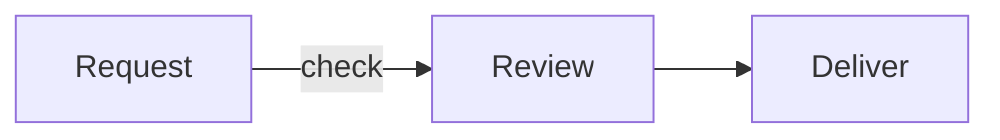
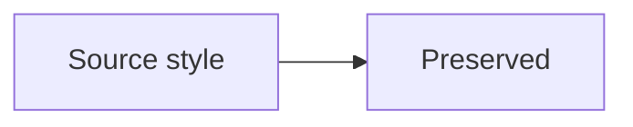

# Automatic Mermaid colors in Slidev

Use this route when a Slidev deck contains native Mermaid fences. Install the
deck-wide setup once so ordinary diagram syntax inherits the established
colorset styling. Keep the diagram source focused on facts and relationships.

## Contents

- [Install the local runtime template](#install-the-local-runtime-template)
- [Style continuity](#style-continuity)
- [Validate rendered output](#validate-rendered-output)

## Install the local runtime template

Copy the contents of
[`assets/templates/slidev-diagram-style/`](../assets/templates/slidev-diagram-style/)
to the deck root. The resulting paths must be `setup/mermaid.ts`,
`setup/mermaid-renderer.ts`, and `diagram-style.mjs`. Merge an existing Mermaid setup into this one returned
configuration rather than registering competing theme defaults. Slidev loads
`setup/mermaid.ts` automatically through `defineMermaidSetup`.

The selector defaults to `mermaidColorsetConfig('colorset1')`. Change that one
argument to `colorset2` for an explicit extended-color request. Record the same
colorset in the deck headmatter or delivery report. Keep Open Sans in the deck
font settings, including the export environment:

```yaml
fonts:
  sans: Open Sans
```

After installation, this fence receives the defaults without an init directive,
`classDef`, a theme attribute, or per-node color declarations:

````markdown

````

The runtime template is self-contained. It uses the native Mermaid setup hook
and a small native renderer hook available in the validated Slidev 52.16.0
runtime. The renderer serializes Mermaid calls and retains the selected palette
when Slidev's UI switches to dark mode. It uses Mermaid itself for parsing,
layout, accessibility, and SVG output, and waits for Open Sans before native
text measurement to prevent cropped labels after asynchronous font loading.
Older Slidev versions without
`defineMermaidRendererSetup` need an upgrade before using this complete template.

## Style continuity

Apply the same exact palette names and colors across the deck, ECharts, Mermaid,
and embedded PlantUML output. The default palette is red plus neutrals. Filled
flowchart/class nodes and sequence participants start with primary red
`#9e1b32`; inside text uses exactly black or white by greater luminance contrast
(white for primary red). Containers use neutral `#e7e7e7`, and links, arrows,
and lifelines use `#696969`. Keep readable black captions on white edge-label
backings. Use opaque solid category bodies without decorative rims while
preserving connectors, class compartments, and actor line art.

`colorset2` retains the primary red and opts into the exact extended sequence:
blue `#007298`, orange `#e77204`, green `#45842a`, purple `#652f6c`, and yellow
`#f1c319`, followed by the bundled dark, bright, neutral, and soft colors.
Family-specific native defaults can use later category roles; the template
chooses their black/white text independently. Do not recolor every node by
position merely because colorset2 is selected. An ordinary workflow uses the
default body role until semantic categories justify additional colors.

The template explicitly sets `theme: 'base'`, light-mode color calculations,
Open Sans, native family paints, finite category scales, and compact layout
spacing. Mermaid may otherwise derive undeclared colors from a base theme.
CSS belongs in the returned `themeCSS`, which Mermaid embeds into each SVG;
page stylesheet rules cannot reach Slidev Mermaid shadow roots. Keep the CSS
selectors scoped to body rims and caption/container labels. Do not zero every
path's stroke width, since that removes connectors and semantic line art.

Preserve supplied relationships, labels, IDs, and accessibility directives.
For an explicit request to retain source paint, outlines, or a different theme,
use the per-fence escape below. It bypasses the colorset configuration, caption
CSS, and native label finishing for that diagram; the underlying Mermaid
renderer retains its ordinary behavior. Report its palette incompatibility
instead of claiming a colorset pass.

````markdown

````

In the normal mode, the renderer ignores Slidev's automatic `theme` option so
UI dark mode cannot replace the selected palette. Mermaid source frontmatter
and init directives can override initialization, but normal colorset CSS still
removes decorative rims and keeps readable captions. Use the source escape when
such supplied paint must remain unchanged. Remove only accidental theme
overrides from authored diagrams intended to follow the deck palette.

## Validate rendered output

Run the bundled static checker before the native build. For a deck requiring
three plain Mermaid blocks, use:

```powershell
uv run --script skills/slidev-echarts/scripts/check_mermaid_deck.py --deck deck --plain-mermaid --expect-blocks 3
```

Use the loaded skill's script path when its installation differs. Set the
expected block count to the task's requirement, or omit it when no count was
requested. The checker reads the three runtime files, package declarations and
balanced Markdown fences; `--plain-mermaid` checks only Mermaid bodies and
fence options. It accepts Slidev headmatter such as `theme: default` and extra
deck CSS. It neither counts slides nor treats headmatter as diagram styling.
Use native Slidev metadata/capture for actual slide count and layout. Omit the
plain-source gate for diagrams intentionally using the source escape.

Run `npm run build` from the deck. Serve the result over HTTP, open native
Mermaid slides, and inspect the SVG inside each `.mermaid` host's shadow root.
Confirm that plain flowchart, sequence, state, and class fences render without
theme boilerplate; body paint, caption text/backing, connector strokes,
container labels, font, and body border widths follow the selected contract.
Inspect the built deck as well as development output. Keep a representative
colorset2 case when changing the template or palette selector.

Check nonblank diagrams, correct edge direction, preserved class compartments
and actor lifelines, accessible title/description, no label overlap or clipped
heads, and readable paint at final slide/export size. Test any other Mermaid
family used in the actual deck: global initialization supplies defaults, but
uncommon renderer families can require their own paint correction. Do not claim
all-family coverage from one flowchart screenshot.

The integration follows the official [Slidev Mermaid setup](https://sli.dev/custom/config-mermaid)
and [Mermaid theme configuration](https://mermaid.js.org/config/theming.html).

The published acceptance pattern is `slidev-echarts-mermaid-defaults`, shown in
[the ECharts deck](https://gvillarroel.github.io/skills/examples/slidev-echarts/#/37).
Use the runtime template above for normal authoring; the acceptance deck is for
maintenance and release verification.
